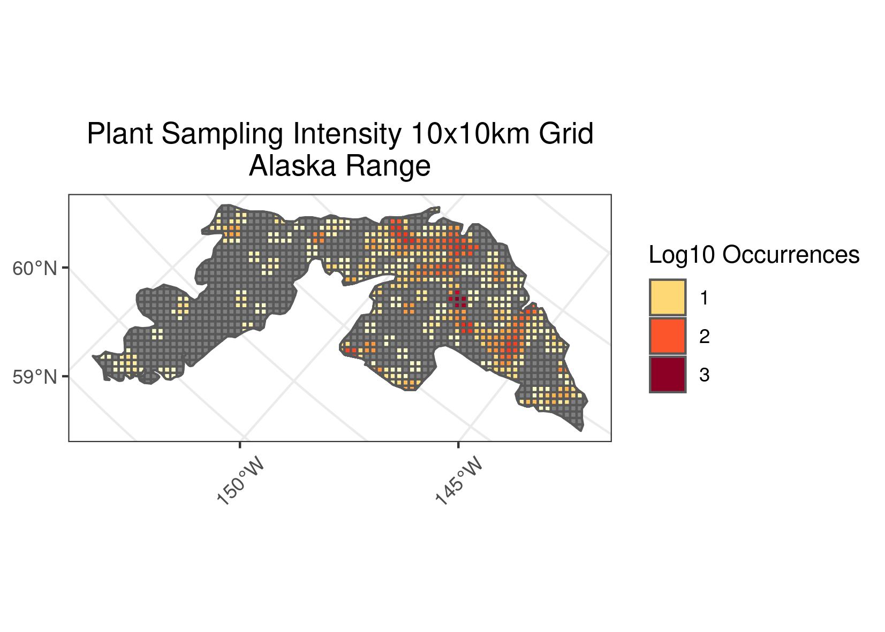
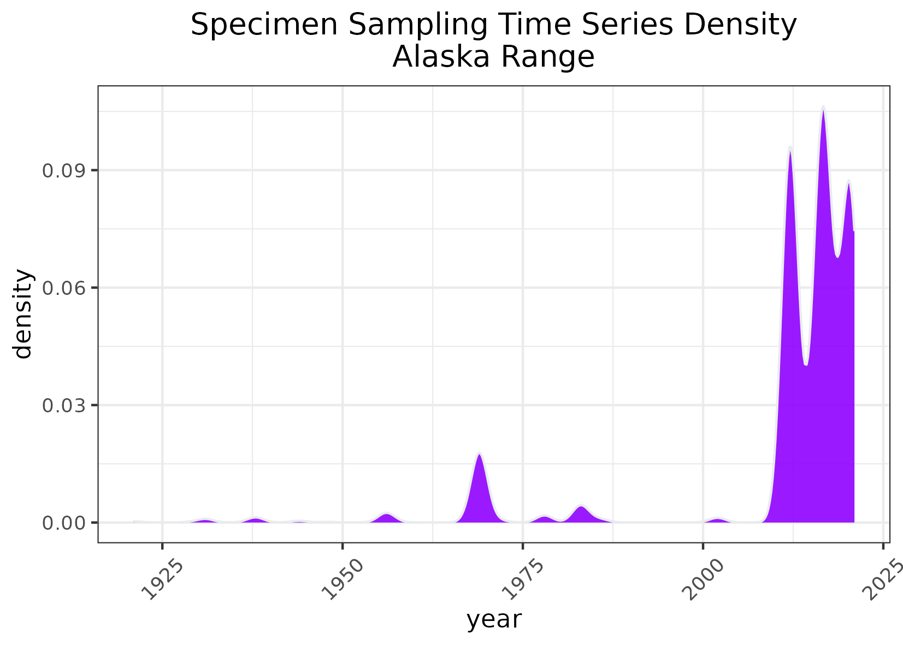
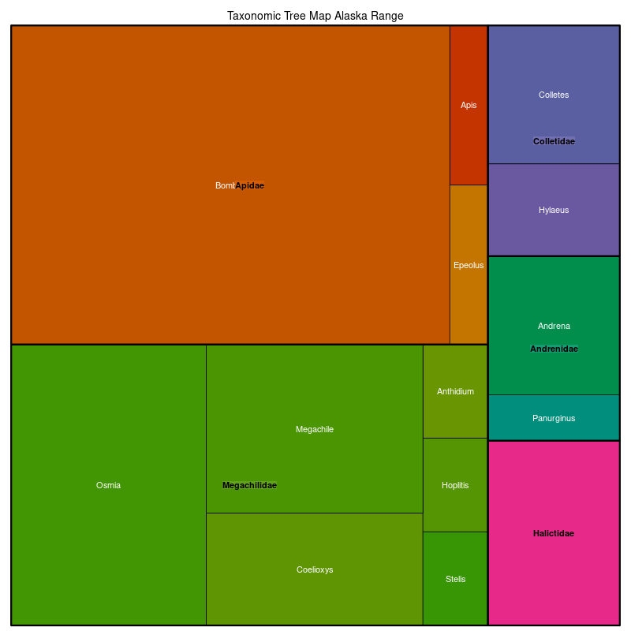

### Alaska Range 
**Location:** Extending across a wide area of south central Alaska.  
**Climate:** The Alaska Range has a subarctic continental climatic regime, but because of the extreme height of many of the ridges and peaks, annual precipitation at higher elevations is similar to that measured for some ecoregions having maritime climate. It is marked by cool summers and cold winters. The mean annual temperature ranges from approximately -6C to 1C. The mean annual precipitation ranges widely, from about 350 mm in lowlands to over 3000 mm on high peaks in the western areas.  
**Vegetation:** Much of the area is barren of vegetation. Dwarf scrub communities are common at higher elevations and on windswept sites where vegetation does exist. Mountain-avens and ericaceous species are typical. Shrub communities of willow, birch, and alder occupy lower slopes and valley bottoms. Forests are rare and relegated to the low-elevation drainages, and contain white and black spruce. 
**Hydrology:** Icefields and glaciers. Streams are high gradient, often braided, carrying heavy glacial sediment loads. Some large lakes in glaciated valleys in the south, a few rock-basin lakes or small ponds in ground moraine areas in the central and eastern part.  
**Terrain:** High and steep mountains, with rocky slopes, icefields, and glaciers. Elevations range from sea level to over 6100 m. The mountains have a complex mix of folded, faulted, deformed metamorphic rocks, along with some granitic batholiths. Large active volcanoes occur in the region.  Discontinuous permafrost underlies shallow and rocky soils.   
**Land Use:** Recreation, subsistence hunting and fishing. Mineral and energy-related mining.  
Note that the above fields were quoted directly from: Wiken et al. 2011 (see front page for full citation).  

