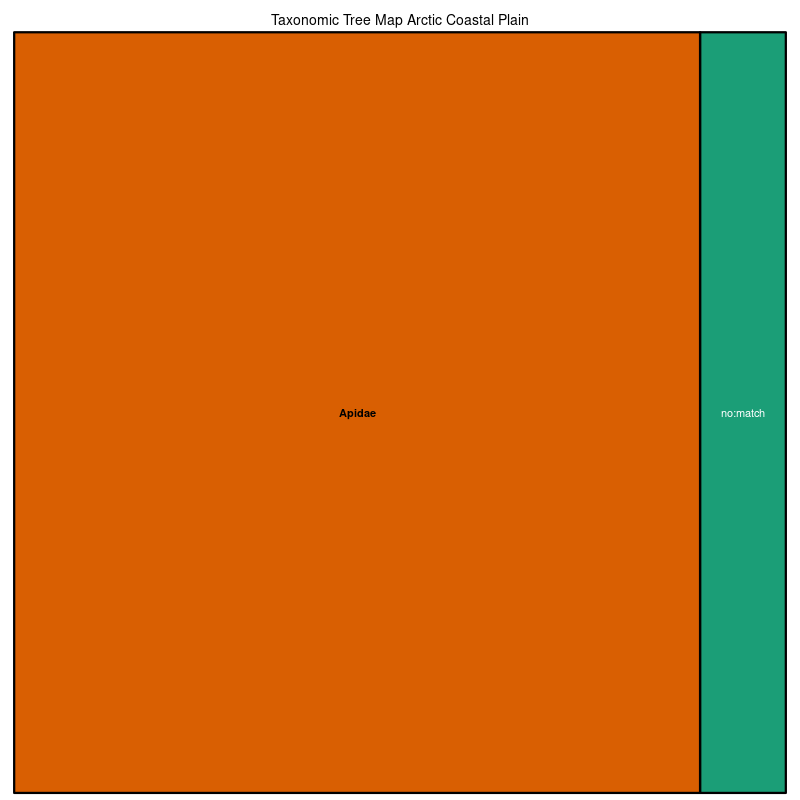

### Arctic Coastal Plain
Location: The northernmost ecoregion in the United States is bounded on the north and the west by the Arctic Ocean and stretches eastward nearly to the international boundary between Alaska and the Yukon Territory, Canada.   
Climate: The ecoregion has a dry, polar tundra or low arctic climate, marked by short, cold, frequently foggy summers and long very cold winters. The mean annual temperature is approximately -11. The mean annual precipitation is low, about 140-200 mm.    
Vegetation: Treeless; wet graminoid herbaceous communities are the predominant vegetation cover, with sedges, rushes, mosses, lichens, and willows.  
Hydrology: Numerous thaw lakes dot the region. Streams and rivers flow north from the mountainous ecoregion to the south. They tend to be sluggish and meandering to the west, more braided to the east.  
Terrain: The poorly drained, flat to undulating coastal plain rises gradually from sea level to the adjacent foothills and is underlain by thick permafrost. Pingos, peat ridges, frost boils, and ice-wedge polygons are common. There is poor soil drainage and thick organic soil horizons.   
Land Use: Native subsistence trapping, hunting, and fishing. Traditional dependence on large marine mammals (e.g., whales, walrus, seals) for food and materials. Oil and gas activities. 
Note that the above fields were quoted directly from: Wiken et al. 2011 (see front page for full citation).  

