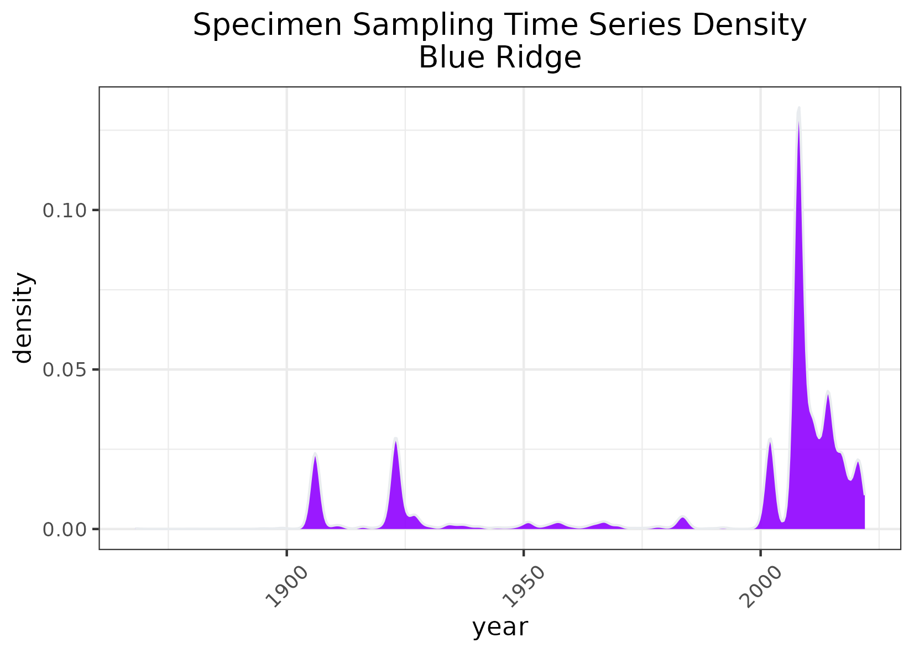
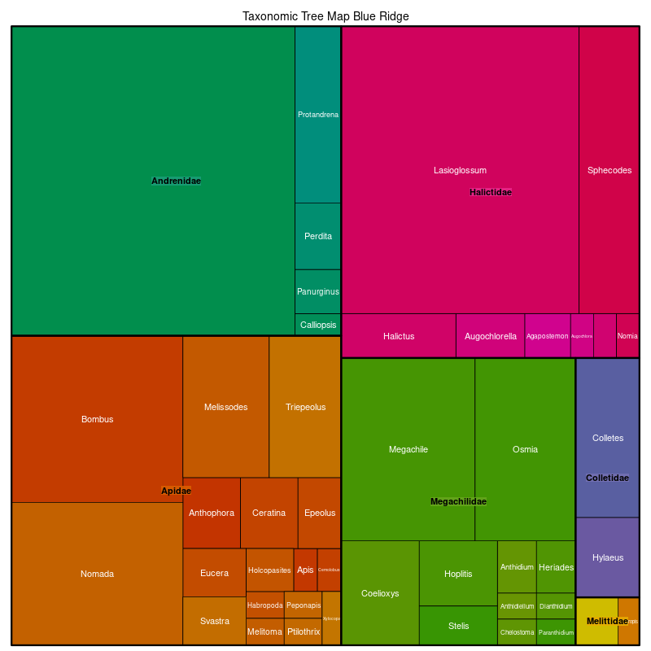

### Blue Ridge
**Location:** Adjacent to the Piedmont (8.3.4), the Blue Ridge extends from southern Pennsylvania to northern Georgia.   
**Climate:** The ecoregion has a severe mid-latitude humid continental climate in the north, and mild mid-latitude humid subtropical climate in the south. It is marked by hot summers and cold to mild winters. The mean annual temperature is approximately 7C at high elevations and 14C in the southern low elevations. The frost-free period ranges from 130 to 210 days. The mean annual precipitation is 1420 mm, ranging from 1100 mm to 2500 mm on high peaks to the south.   
**Vegetation:** Part of one of the richest temperate broadleaf forests in the world, with a high diversity of flora. Mostly Appalachian oak forests, but a variety of oak, hemlock, cove hardwoods, and pine communities within this forest type. Many forests once dominated by American chestnut, an ecologically and economically important tree that provided food and shelter to many animal species. The Chestnut blight, introduced to the U.S. around 1904, killed most all of the chestnut trees by the 1930's. In place of the chestnut, other trees, such as tulip poplar, chestnut oak, white oak, black locust, red maple, and pine species have become important canopy dominants. At higher elevations, northern hardwoods of beech, yellow birch, yellow buckeye, and maples are typical. At the highest elevations, Southeastern spruce-fir forests of Fraser fir, red spruce, yellow birch, and rhododendron are found.  
**Hydrology:** High density of perennial high gradient, cool, clear streams with bedrock and boulder substrates. Lacks lakes, but a few large reservoirs.  
**Terrain:** Varies from narrow ridges to hilly plateaus to more massive mountainous areas with high peaks reaching over 1800 m. Generally rugged terrain on primarily metamorphic bedrock (gneiss, schist, and quartzites). Minor areas of igneous and sedimentary geology also occur. Elevations range from 300 m to 1500 m, with Mount Mitchell, the highest point in the U.S. east of the Mississippi River, reaching 2037 m. Inceptisols and Ultisols are typical, with mesic soil temperatures and udic soil moisture regimes.  
**Land Use:** Forest-related land uses occur along with some small areas of pasture and hay production, apple orchards, and Fraser fir Christmas tree farms. Recreation, tourism, and hunting are important. Some large areas of public lands including national forests and national parks. Larger settlements include Mountain City, Erwin, and Gatlinburg, Tennessee; Boone, Asheville, Franklin, and Brevard, North Carolina; and Blue Ridge, Jasper, and Canton, Georgia.   
Note that the above fields were quoted directly from: Wiken et al. 2011 (see front page for full citation).  

