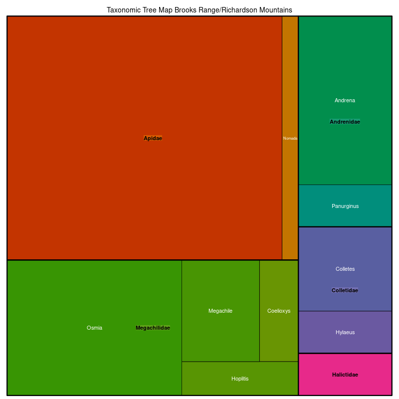

### Brooks Range/Richardson Mountains 

Location: The region extends from the Richardson Mountains in the northern Yukon Territory and traverses much of the east-west extent of northern Alaska to within 100 km of the Chukchi Sea. It is sometimes considered the northern extension of the Rocky Mountains.   
Climate: The dry polar climate has short, cool summers and long, cold winters. Air temperatures decrease rapidly with rising elevation but climate is variable due to aspect, winds, and other factors. The mean annual temperature ranges from approximately -12 to -6 C. The mean annual precipitation ranges from 200 to 600 mm.   
Vegetation: Generally, a sparse vegetation cover, limited to valleys and lower hillslopes. Dwarf scrub vegetation occurs throughout the mountains, although some valleys provide more mesic sites for graminoid herbacious communities dominated by sedges and willows, with abundant mosses. Alpine tundra and barrens are at higher elevations.   
Hydrology: Streams are often high gradient, incised, and in a trellis drainage pattern, with major streams draining north or south and their tributaries draining east and west. Lakes are relatively sparse, with some located in morainal areas, in floodplains, or in rock basins. 
Terrain:  This ecoregion consists of several groups of rugged, deeply dissected mountains carved from uplifted Paleozoic and Mesozoic sedimentary and some metamorphic rock. Unstable hillslopes are common. To the west and east, the topography becomes less rugged. The Richardson Mountains tend to have flat-topped summits flanked by stepped slopes. Elevation of mountain peaks ranges from 800 m in the relatively low Baird Mountains in the west to 2400 m in the central and eastern Brooks Range. Pleistocene glaciation was extensive, and small glaciers persist at elevations above 1800 m. Continuous thick permafrost underlies the region. 
Land Use: Historically used by nomadic groups for subsistence hunting and fishing and gathering. Some mining.   
Note that the above fields were quoted directly from: Wiken et al. 2011 (see front page for full citation).  

