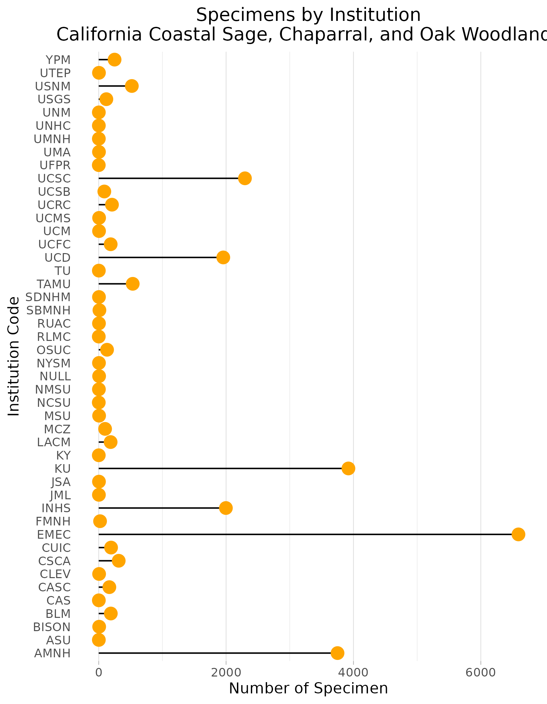

### California Coastal Sage, Chaparral, and Oak Woodlands
**Location:** Central and Southern California and NorthWestern Baja California (also includes channel islands).   
**Climate:** The ecoregion has a Mediterranean climate of hot dry summers and mild winters. The mean annual temperature ranges from approximately 14C to 18xC. The frost-free period ranges from 180 to 365 days. The mean annual precipitation is 548 mm and ranges from 200 mm to more than 1400 mm on higher peaks in the northern portion. Coastal fogs provide some moisture in the dry season.    
**Vegetation:** Vegetation: Mainly chaparral and oak woodlands; grasslands occur in some lower elevations and patches of pine are found at higher elevations. In the south, coastal sage scrub with chamise, white sage, black sage, California buckwheat, golden yarrow, coastal cholla. A small area of Torrey pine near San Diego. Inland chaparral with ceanothus, buckeye, manzanita, scrub oak, and mountain-mahogany. Coast live oak, canyon live oak, poison oak, California black walnut also occur. Around the Central Valley, blue oaks, and some Coulter pine, Digger pine, Jeffrey pine, or big-cone Douglas-fir at high elevations.   
**Hydrology:** Mostly ephemeral and intermittent streams. A few perennial streams enter the region from adjacent highland ecoregions. Generally lacks lakes, but a few ponds and reservoirs occur.  
**Terrain:** Coastal terraces, some open low mountains or foothills, parallel ranges and valleys, and areas of irregular plains in the south and near the border of the adjacent Central California Valley ecoregion (11.1.2). Cenozoic marine and non-marine sedimentary rocks, Mesozoic granitic rocks. Coarse sediments on colluvial slopes. Dominant soil orders include Alfosols, Entisols, and Mollisols, with a thermic soil temperature regime and xeric soil moisture regime.   
**Land Use:** Urban, suburban, industrial, recreation, tourism, some livestock grazing, diversified cropland with lettuce, artichokes, spinach, celery, tomatoes, strawberries, citrus, avocados, vineyards, and nursery products. Large cities include San Francisco, Oakland, San Jose, Los Angeles, Long Beach, Riverside, Santa Ana, Anaheim, San Diego, Tijuana, and Ensenada.  

Note that the above fields were quoted directly from: Wiken et al. 2011 (see front page for full citation).  

