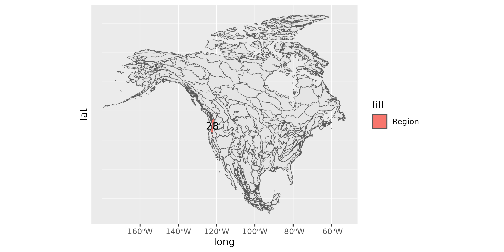
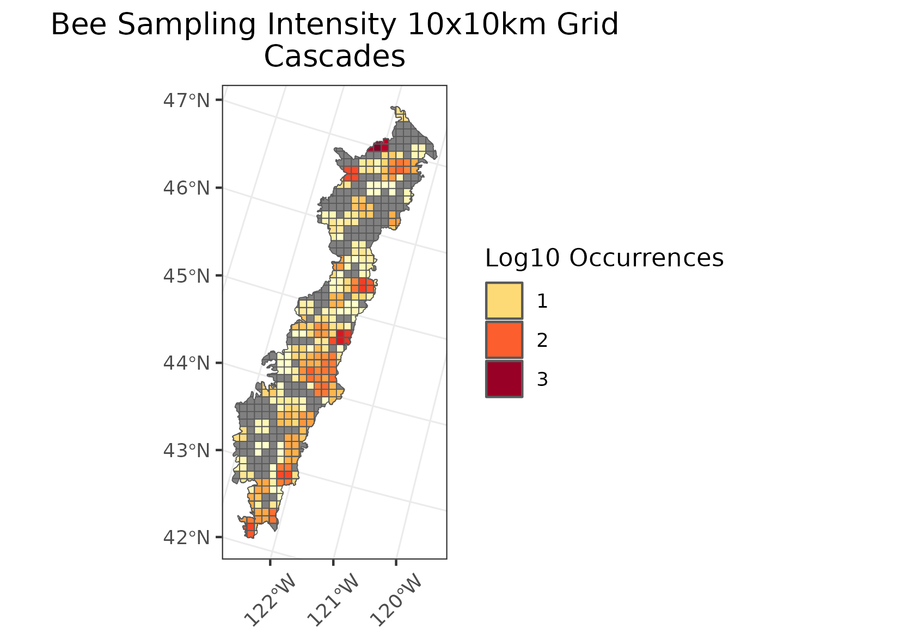
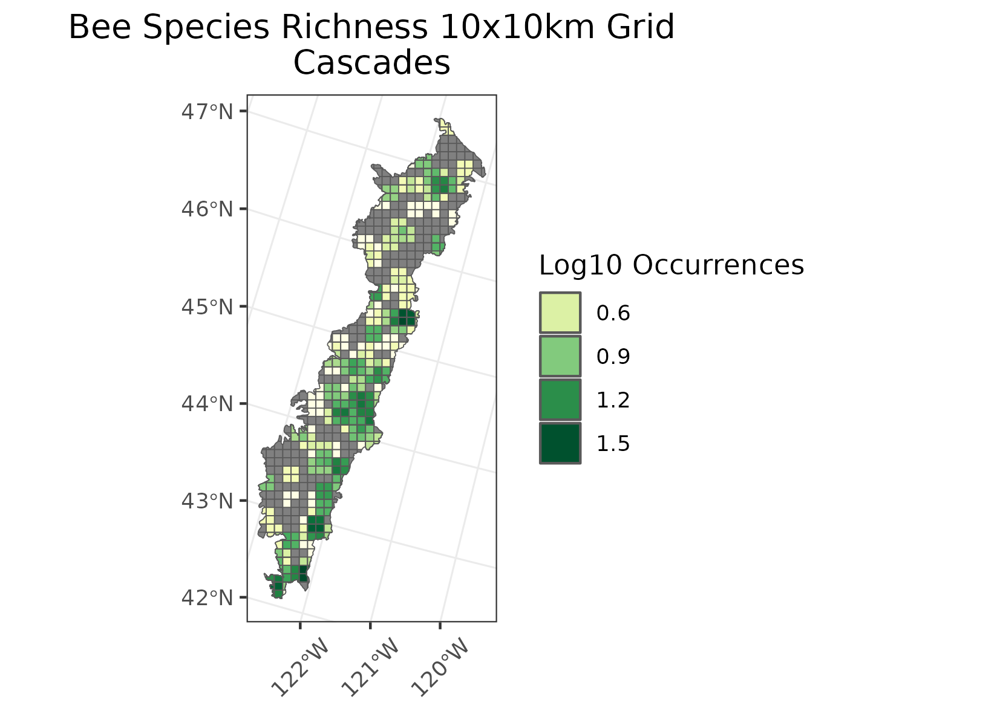
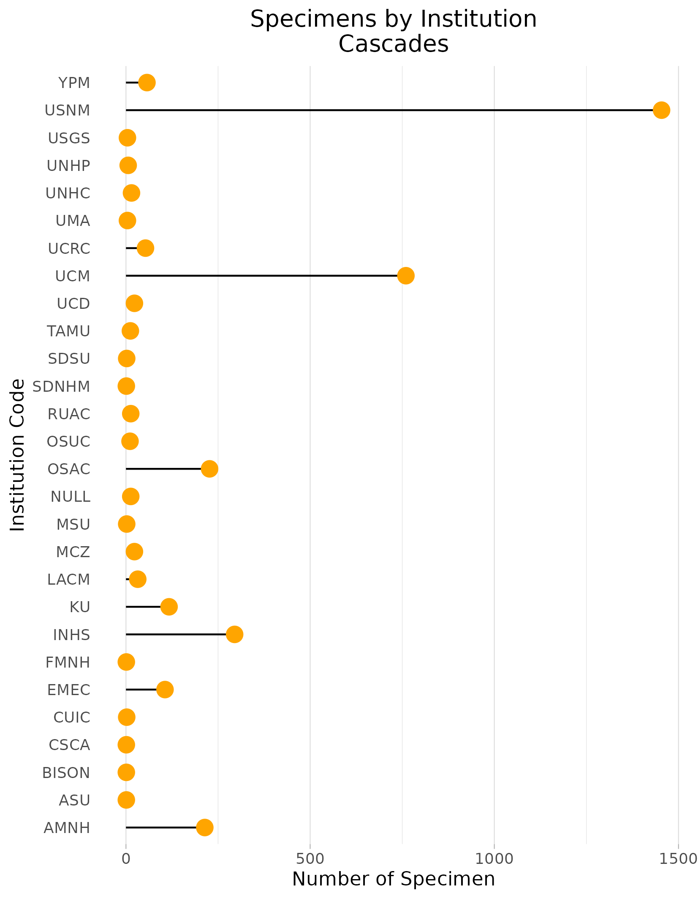
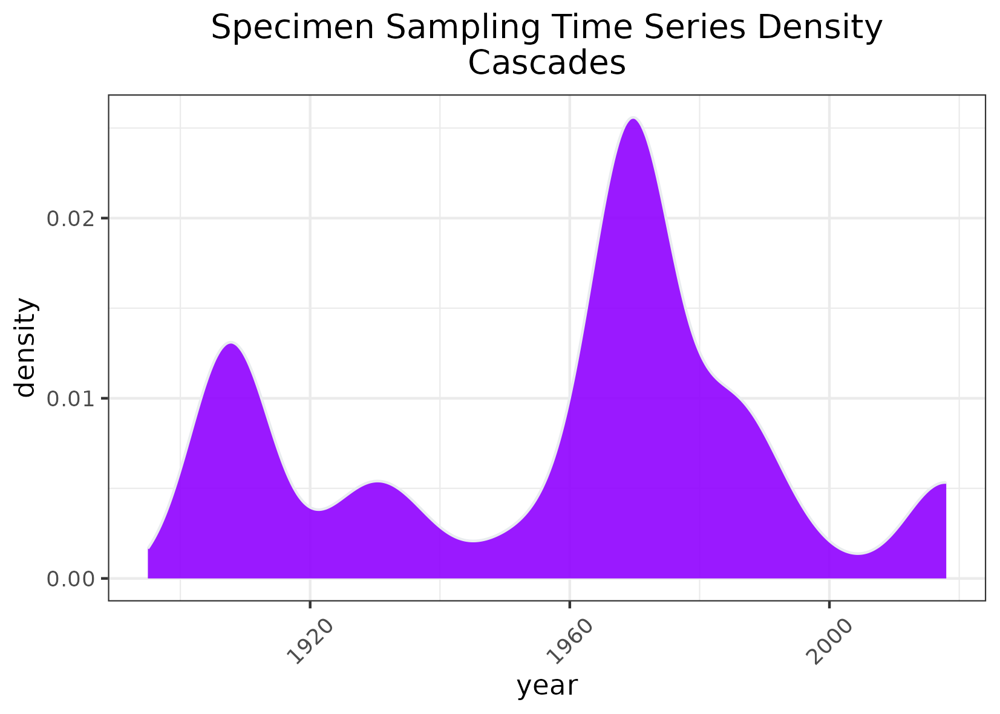

### Cascades
Location: Stretches from the central portion of western Washington, through the spine of Oregon, and includes a disjunct area around Mt. Shasta in northern California.   
Climate: The ecoregion has a mild to severe mid-latitude climate, varying by elevation, with mostly dry warm summers and relatively mild to cool very wet winters. The mean annual temperature ranges from approximately -1C to 11C. The frost-free period ranges widely from 5 to 180 days depending on elevation and latitude. The mean annual precipitation is 1824 mm, ranging from 1150 mm to 3600 mm.    
Vegetation: Extensive and highly productive coniferous forests. At lower elevations, Douglas-fir, western hemlock, western red cedar, big leaf maple, red alder. At higher elevations, Pacific silver fir, mountain hemlock, subalpine fir, noble fir, lodgepole pine. To the south, Shasta red fir, white fir. Subalpine meadows and rocky alpine zones occur at highest elevations.  
Hydrology: Many intermittent and perennial streams in a dense drainage network; many alpine lakes; some large reservoirs at lower elevations. Water quality is high.  
Terrain:  This mountainous ecoregion is underlain by Cenozoic volcanics and has been affected by alpine glaciations. It is characterized by steep ridges and river valleys in the west, a high plateau in the east, and both active and dormant volcanoes. Elevations range from about 250 meters upwards to 4,390 meters. Soils are mostly cryic and frigid temperature regimes, with some mesic at low elevations and in the south. Andisols and Inceptisols are common.  
Land Use: Forestry, recreation, water supply for urban and agricultural areas in adjacent lowland ecoregions, a few areas of ranching and livestock grazing. Large areas are in public lands (national forests, national parks) and population density is relatively low. No cities occur in the region. Larger towns include Stevenson, Cascade Locks, and Oakridge.  
Note that the above fields were quoted directly from: Wiken et al. 2011 (see front page for full citation).  

