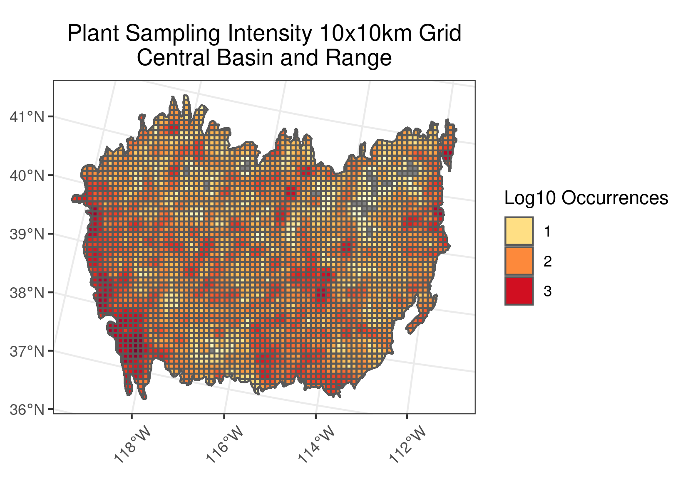
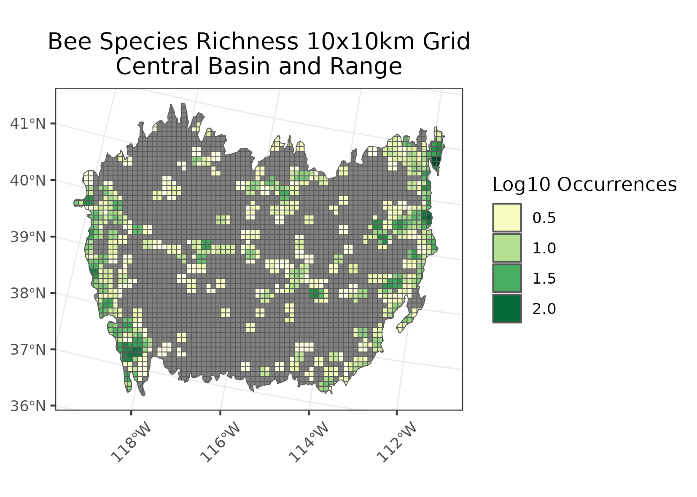
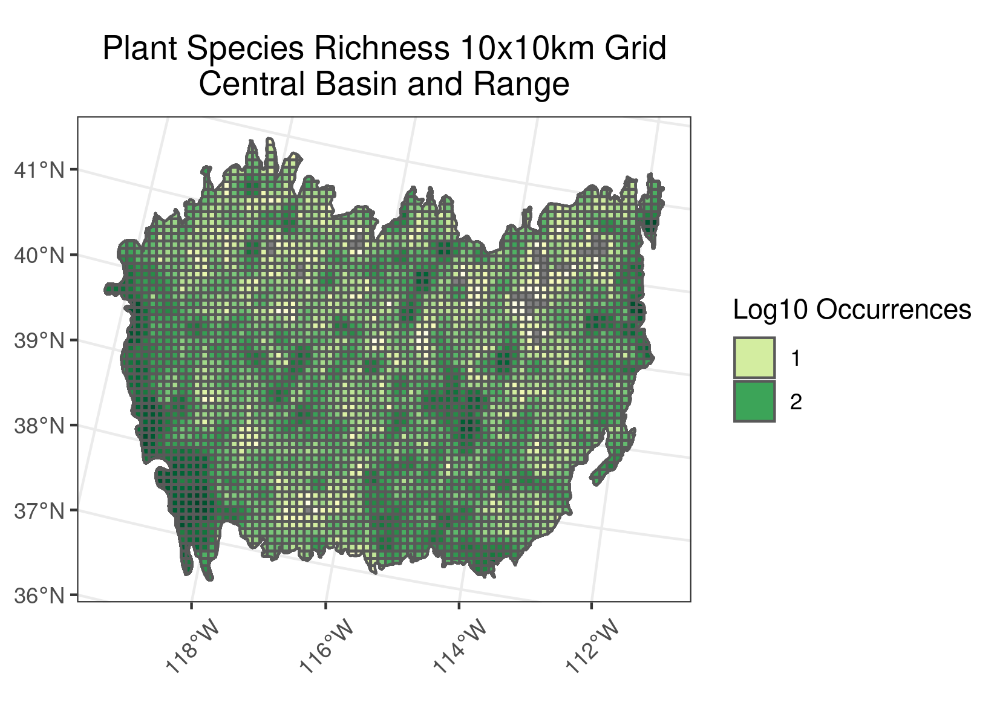
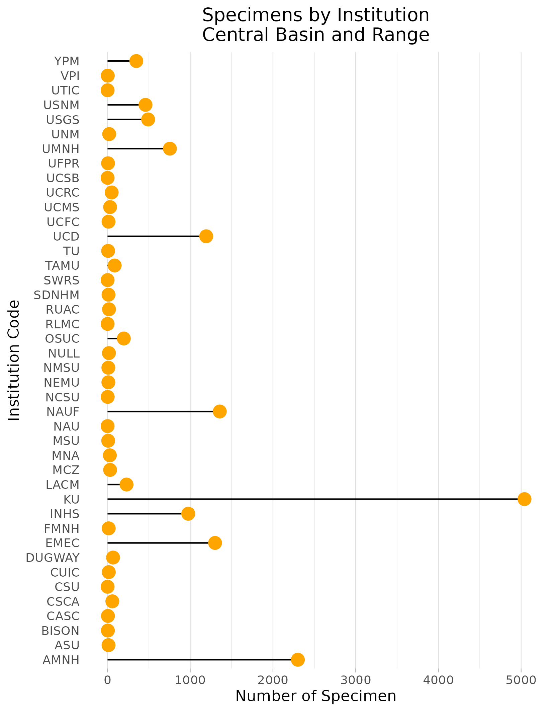
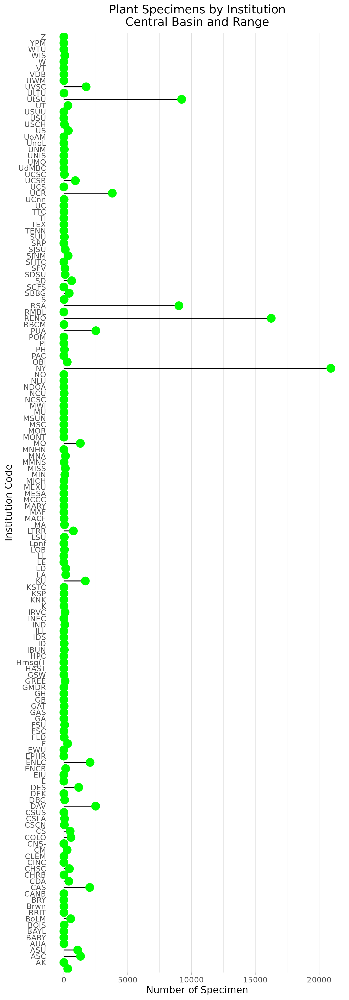
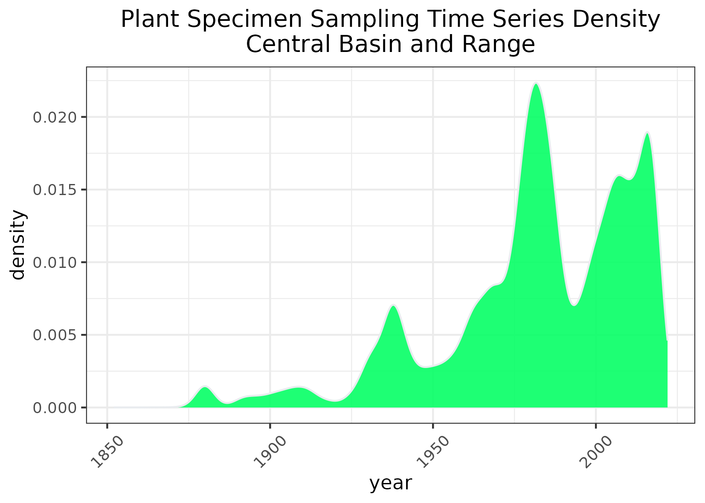
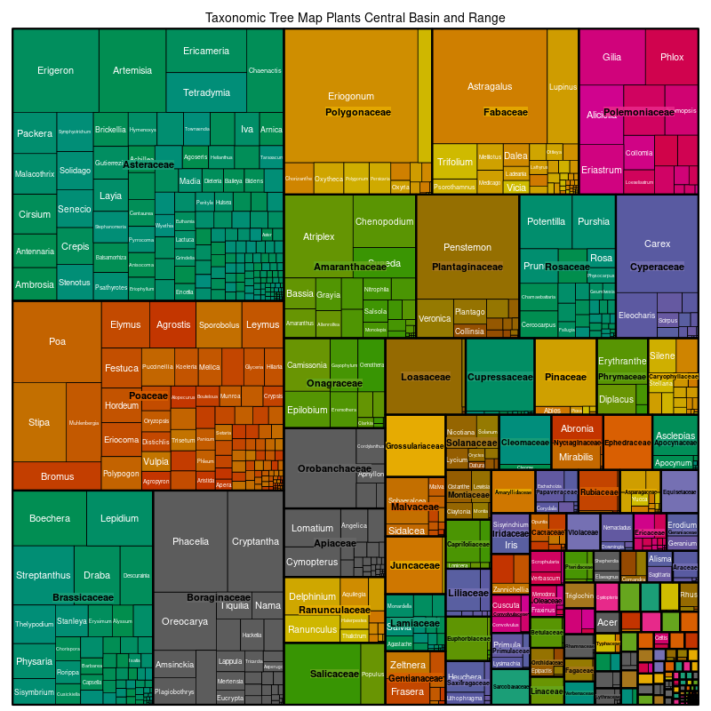

### The Central Basin and Range
**Location:** Primarily Nevada & western Utah, small extensions into Idaho and California.  
**Climate:** dry desert climate: hot summers and mild winters. Not quite as hot as the Sonoran. Varied elevation causes a wide range of temperatures in this ecoregion. Most rainfall occurs from thunderstorms during the warmseason. Light percipitation in winters mostly in the form of snow.  
**Vegetation:** Sagebrush is a primary feature. High elevation areas contain gymnosperms such as Douglas fir, white fir, limber pine etc. 
**Hydrology:** Internally Drained. Most Streams are intermittent and ephemeral. There are some large lakes in this ecoregion ex. Great Salt Lake. 
**Terrain:** Large basins with playas and salt flats. Soil ranges from mesic to xeric. Saline soils present.  
**Land Use:** Ranching, mining, wildlife habitat reserves, and recreation are common. Largely populated cities are on the margins of this ecoregion including Carson City, Reno, Sparks, Salt Lake City, etc. 

 

