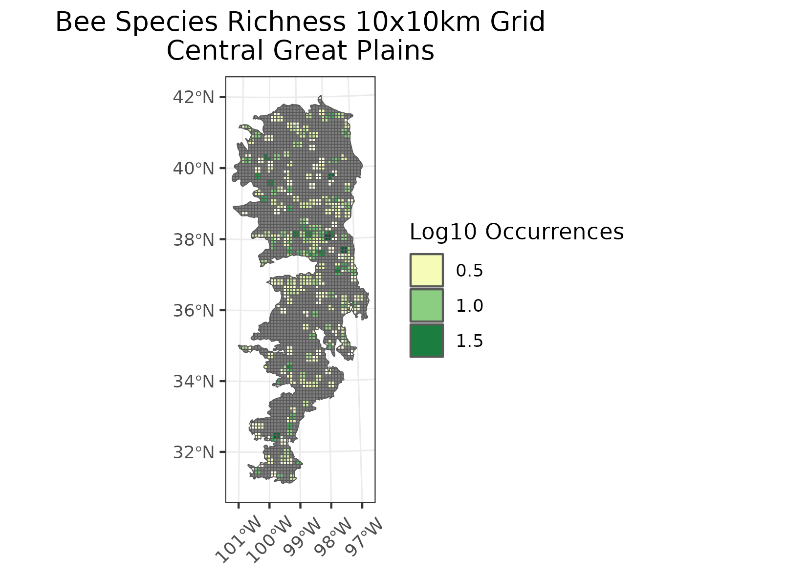
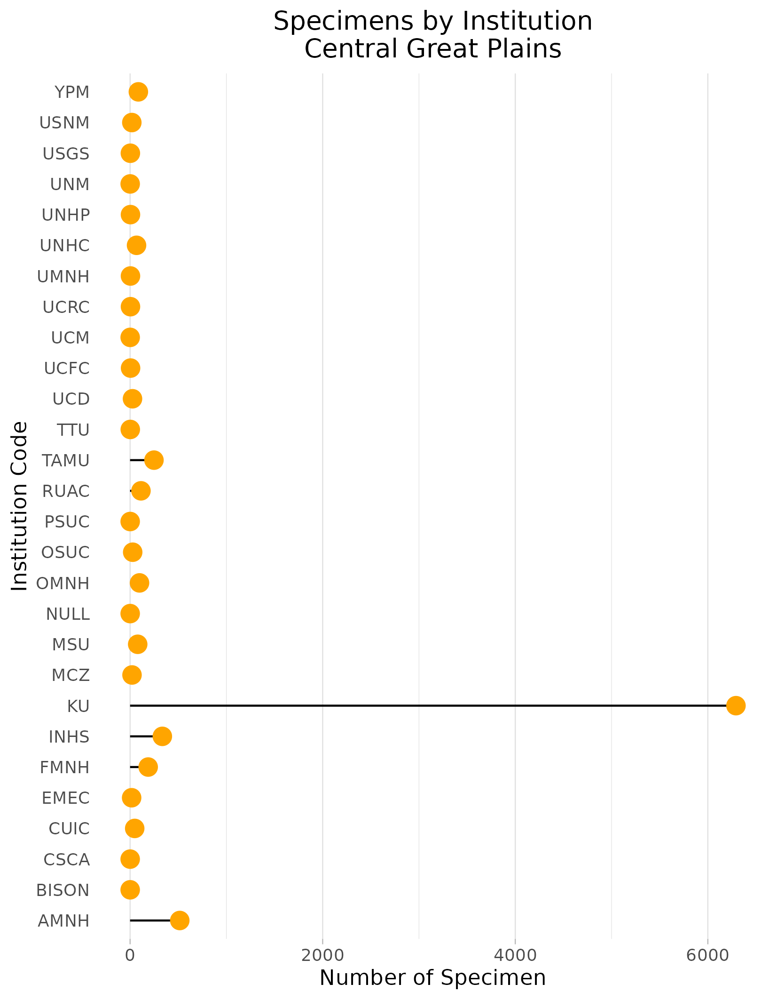
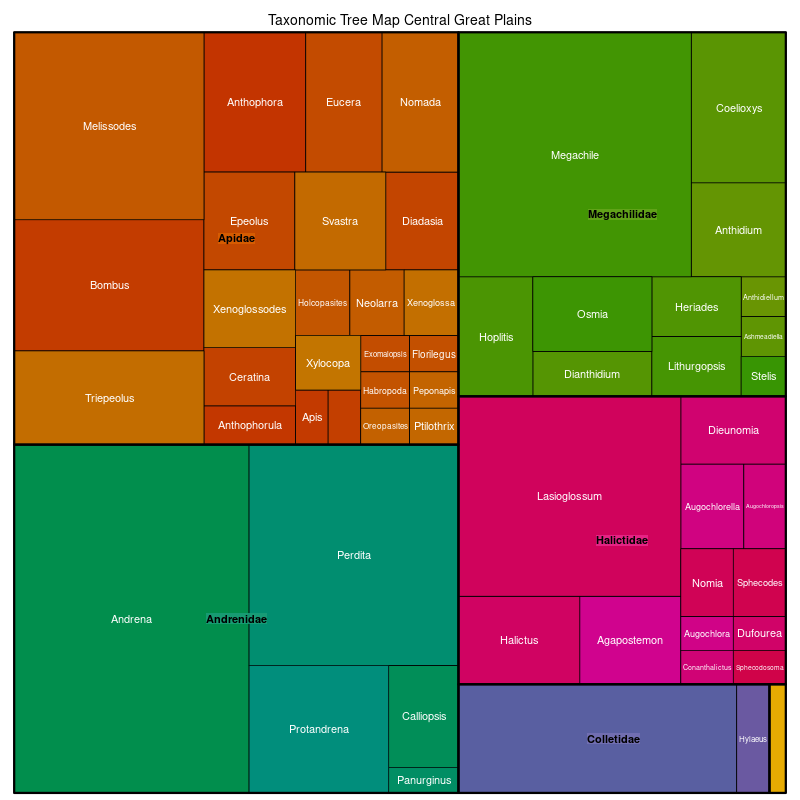

### Central Great Plains
Location:In central Nebraska, Kansas, Oklahoma, and north-central Texas, a transitional prairie region between the tallgrass regions to the east and the shortgrass regions to the west.    
Climate: The ecoregion is on the borders of  some different climate zones: severe to mild mid-latitude climates north to south and more humid to dry steppe climates from east to west. It is marked by hot summers and mild to severe winters. The mean annual temperature ranges from approximately 10C in the north to 18C in the south. The frost-free period ranges from a low of 150 days in the north to 240 days in the south. The mean annual precipitation is 658 mm, ranging from 455 mm to 940 mm.    
Vegetation: Once a transitional, mostly mixed-grass prairie, with some scattered low trees and shrubs in the south, much of this ecological region is now cropland. Little bluestem, big bluestem, sideoats grama, blue grama, Indiangrass, sand bluestem, sand dropseed were typical. To the south, Texas wintergrass, buffalograss, white tridens, along with some honey mesquite, lotebush, sand sagebrush, and yucca.  
Hydrology: Mostly intermittent and a few perennial streams. Some larger rivers cross the region, typically with braided, sandy channels, often turbid water. Some springs occur. Few natural lakes. 
Terrain: Nearly level to irregular plains, broad alluvial valleys, some more hilly, dissected plains. Slightly lower elevations and somewhat more irregular than the High Plains (9.4.1) to the west. Cretaceous limestone and shale, Tertiary sandstone in the north. To the south, Permian shale, sandstone, gypsum, and dolomite. Mollisols, Entisols, and Alfisols are dominant with some Vertisols in the south. Mostly thermic soil temperature regimes, mesic in the north, and ustic soil moisture regimes.   
Land Use: Dominated by dryland and irrigated cropland. Some pasture and rangeland. the eastern boundary of the region marks the eastern limits of the major winter wheat growing area of the United States. Other crops include corn, grain sorghum, alfalfa, and cotton. Oil and gas production. Larger towns and cities include North Platte, Kearney, Grand Island, Columbus, Hastings, Hays, Salina, McPherson, Hutchinson, Wichita, Ponca City, Stillwater, Oklahoma City, Norman, Lawton, Wichita Falls, Abilene, and San Angelo.  
Note that the above fields were quoted directly from: Wiken et al. 2011 (see front page for full citation).  

