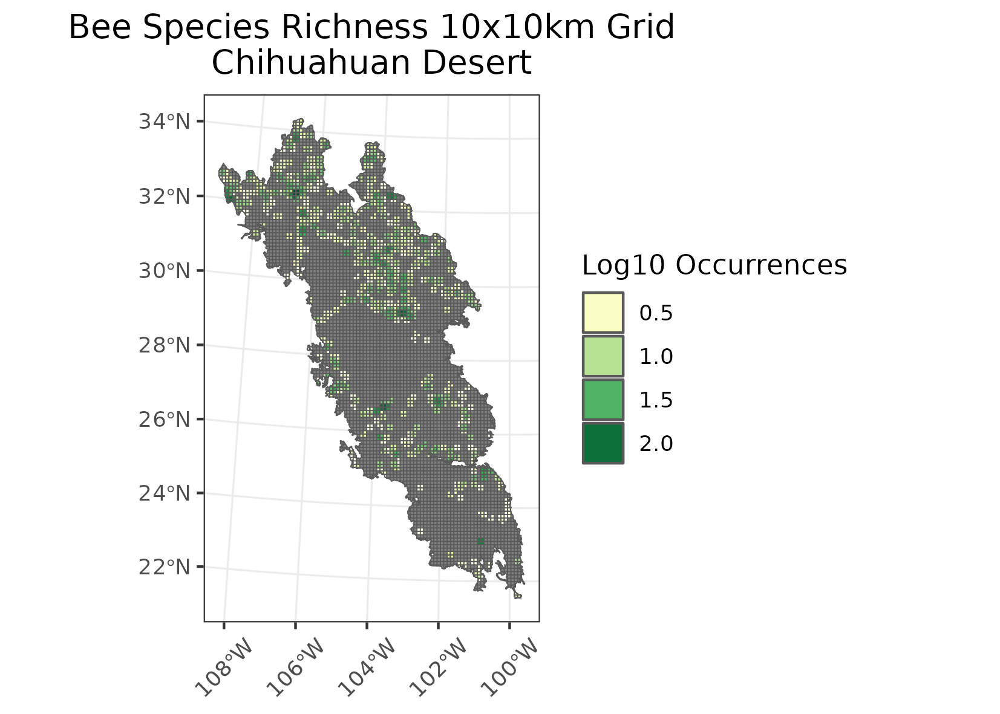
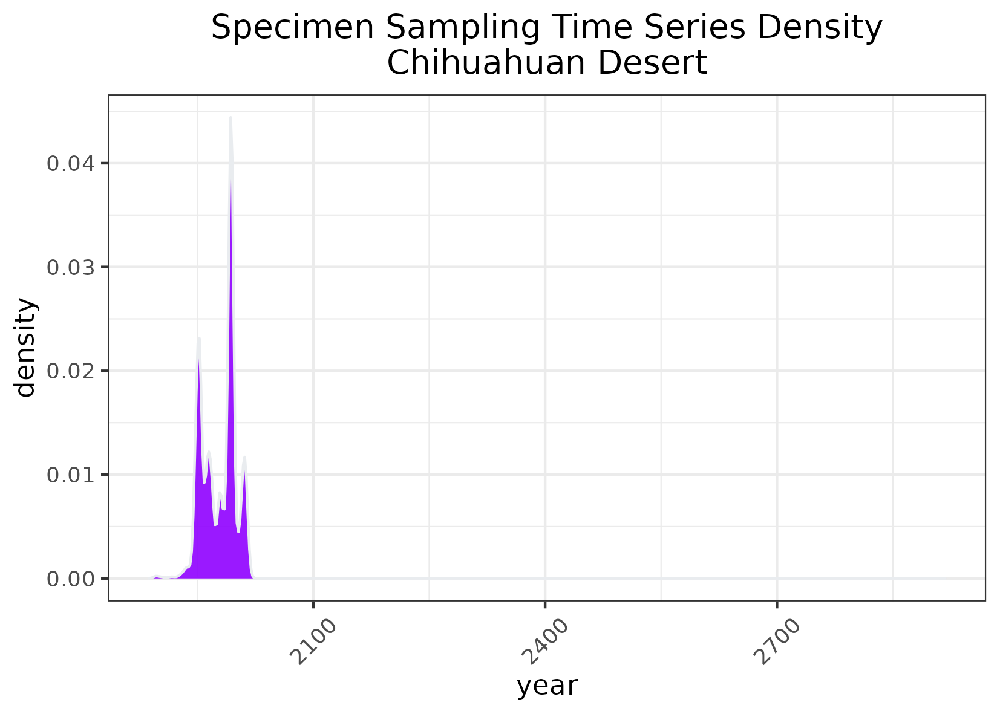

### The Chihuahuan Desert
**Location:** From central N. New Mexico, W. Texas, and extends into Mexico.   
**Climate:** Dry desert with steppe climate. Hot summers & mild winters. Most rainfall occurs during the summers.   
**Vegetation:** Primarily desert grasslands & arid shrubs. High elevation islands have oaks, junipers, and pines. Desert shrubland is thought to be expanding as desertification increases gradually. In the basins Larrea, mesquite, and yuccas are common.   
**Hydrology:** Mostly emphemeral streams, and a few springs. Largely internally drained outside of Rio Grande, Rio Conchos, and Pecos River. Some lakes within the playas.  
**Terrain:** Physiogeography is similar to that/an extension of the Central Basin and Range.    
**Land Use:** Ranching, military, and public land use. Major populations: Las Cruces, El Paso, and Matehuala  

