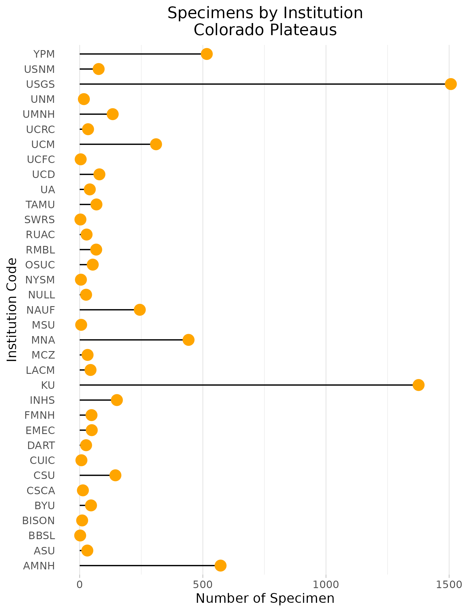
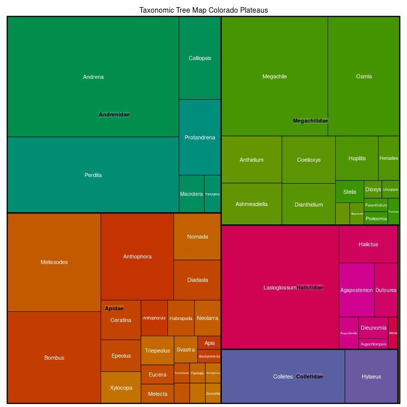

### The Colorado Plateaus
Location: Between the Southern Rocky Mountains and the Wasatch Range. Occupies most of eastern and sourthern Utah, along with western Colorado, and small portions of northern Arizona and northwestern New Mexico.  
Climate: Dry steppe climate. Hot summers (low humidity) and cool/cold dry winters.  
Vegetation: Blackbrush, shadscale, saltbrush in the low elevation areas. Higher elevation valleys have oaks & junipers. 
Hydrology: Many ephemeral streams. Several large rivers: Colorado, San Juan. Few lakes or resevoirs besides Lake Powell  
Terrain: Tableland, mostly mesic soil regimes.  
Land Use: Ranching, oil & gas & coal mining/extraction, recreation, and tourism. Tribal lands & national parks. Large towns: Vernal, Price, Moab, Grand Junction, etc.  

