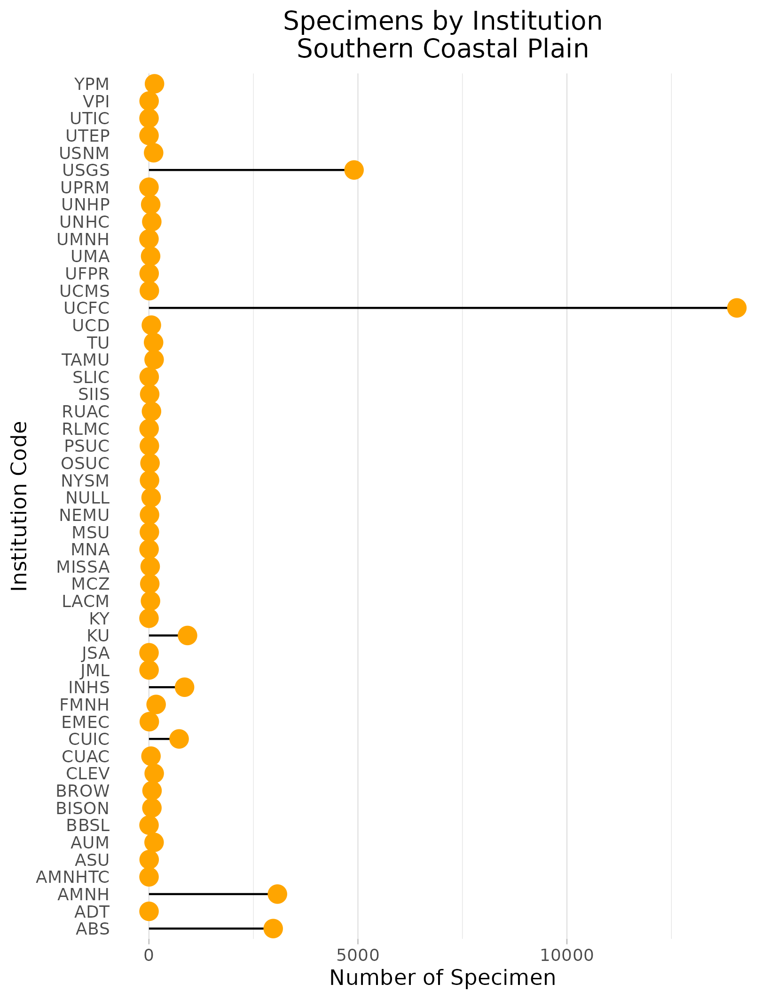
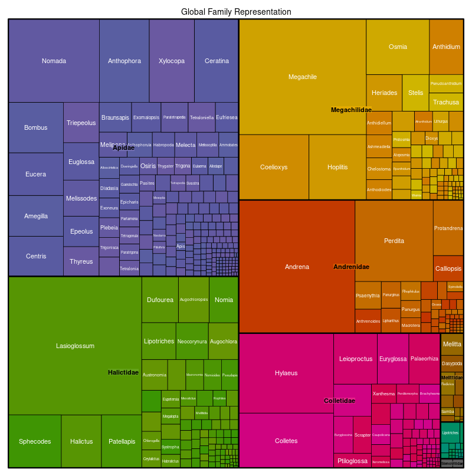

### Explanation of Figures

To measure intensity of sampling in ecoregions as well as richness I conducted the following:
- I converted the ecoregions shapefiles & the occurrence data into Lambert Azimuthal Equal Area. 
- Created a grid of 10x10km over the ecoregion
- Buffered the occurrence data points to account for potential of overlapping into neighboring grid cells. This was done by creating a radius of buffer equal to 1/2 the distance of a grid cell side. 
- Occurrence data was then joined to the ecoregion gridded data, cells were counted for how many times an occurrence overlapped each grid cell creating the output for the intensity maps. 
- Each grid cell was measured for number of unique species occurring, creating the output for the richness maps. 
- Note that in both cases a log base 10 transformation log10(I/R + 1) was preformed for visualization purposes. 

Examples of intensity maps and richness maps:

To find out where these specimens sit in each ecoregion:
- Summed up the number of occurrence records per institution
- Presented them in a lolliplop plot to illustrate which institutions may be worth prioritizing. 

Example of Institution lolliplop plot:

To measure the temporal scope of sampling:
- Summed up the number of occurrences that that occurred per year
- Created geom_density plots to visualize when sampling the most sampling occurs. Note that these are densities, not total number of specimens measured per year

Example of timeseries map

To measure the taxonomic scope of specimens available:
- Created a list of unique species in each ecoregion. 
- Left-joined DiscoverLife's Bee Species guide's catalogue to attach the family to each of these species per ecoregion
- Weighted the taxonomic groups, by counting the number of species per family & genus 
- Created tree diagrams: These illustrate the quantity of the taxonomic subdivisions per ecoregion. 

Example of tree diagram: Here, we're looking at the global representation of taxonomy weighting in bees. First, the diagram is subdivided into the bee families Apidae, Halicitidae, Andrenidae, Colletidae, Mellitidae, Stenotritidae according to the "weight" of how many species are described in each family. This follows the same principle for the genus level. 

