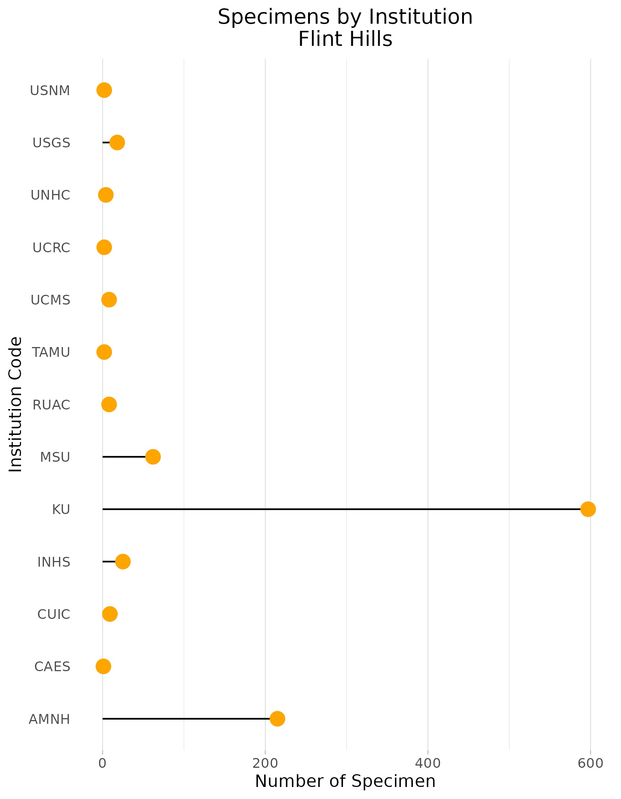

### Flint Hills

**Location:** The Flint Hills in eastern Kansas and the Osage Hills in north-central Oklahoma mark the western edge of the tallgrass prairie.   
**Climate:** The ecoregion has a severe mid-latitude climate humid continental climate, marked by  hot summers and mild to severe winters. The mean annual temperature is approximately 12C to 15C. The frost-free period ranges from 170 to 200 days. The mean annual precipitation is 880 mm, ranges 710 mm to 1065 mm.   
**Vegetation:** The Flint Hills mark the western edge of the tallgrass prairie, and contain the largest remaining intact tallgrass prairie in the Great Plains. Big bluestem, switchgrass, Indiangrass, and little bluestem are dominant grasses. 
**Hydrology:** Intermittent and perennial streams, low to moderate gradient. Several springs occur to increase summer base flow in some streams. Few lakes occur in the region.  
**Terrain:** Rolling hills, cuestas, and relatively narrow steep valleys. Elevations range from 245 m to 495 m. The region is composed mostly of Pennsylvanian and Permian-age shale and cherty limestone with rocky soils. The flint-like cherty beds of limestone contributed to the areas name. Mollisols are typical with a mesic or thermic soil temperature regime and udic or ustic soil moisture regime.   
**Land Use:** In contrast to surrounding ecological regions that are mostly in cropland, the Flint Hills were difficult to plow. Most of the Flint Hills region is grazed by beef cattle. Small areas of cropland occur in some river valleys. Part of the region is now in national preserve land and other conservation land. Larger towns include Manhattan, Emporia, and El Dorado.  
Note that the above fields were quoted directly from: Wiken et al. 2011 (see front page for full citation).  

