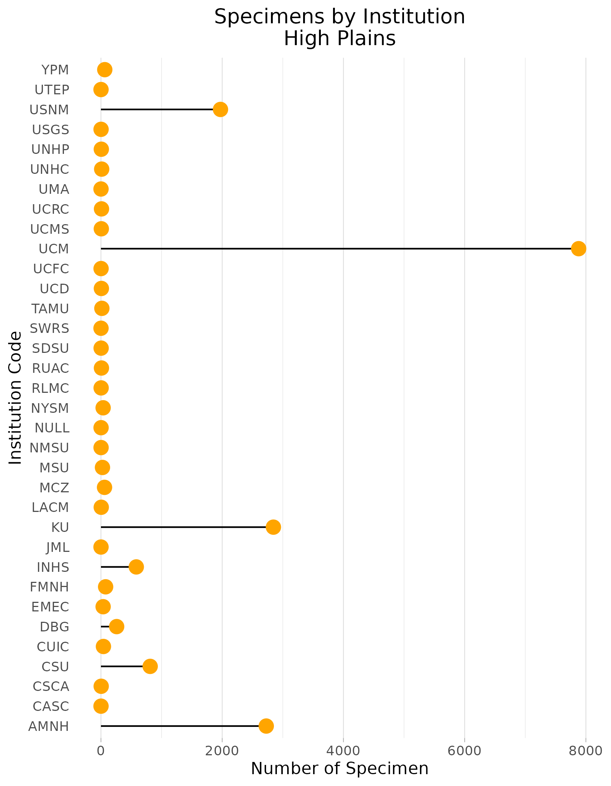
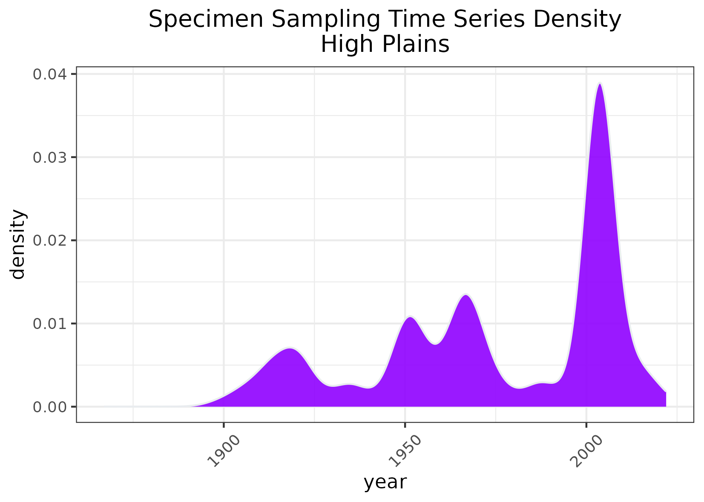

### High Plains
**Location:** Covers a large latitudinal extent, from southeastern Wyoming, western Nebraska, eastern Colorado, western Kansas, through the panhandles of Oklahoma and Texas, and into eastern New Mexico.   
**Climate:** The ecoregion has a dry mid-latitude steppe climate. It is drier than the Central Great Plains (9.4.2) to the east, and is marked by hot summers and cold winters. The mean annual temperature varies by latitude, from approximately 8C in the north to 17C in the far south. The frost-free period ranges from 120 to 230 days. The mean annual precipitation is 433 mm, and ranges from 305 mm to 530 mm.    
**Vegetation:** Mostly short and midgrass prairie vegetation, much of it greatly altered. Shortgrass prairie with blue grama, buffalograss, fringed sage. Mixed grass areas with sideoats grama, western wheatgrass, little bluestem. Sandsage prairies with sand sagebrush, sand bluestem, prairie sandreed, little bluestem, Indian ricegrass, sand dropseed. Shinnery sands in the south, with Havard shin oak, fourwing saltbush, sand sagebrush, yucca, and mid and shortgrasses. 
**Hydrology:** Mostly intermittent and ephemeral streams. A few larger rivers that originate in the Southern Rockies (6.2.14) cross the region, such as the Platte, Arkansas, and Cimarron. The southern portion has few to no streams. Surface water there occurs in numerous ephemeral pools or playas. These serve as recharge areas for the important Ogallala Aquifer. Water withdrawals from the aquifer usually exceeds recharge.  
**Terrain:** Mostly intermittent and ephemeral streams. A few larger rivers that originate in the Southern Rockies (6.2.14) cross the region, such as the Platte, Arkansas, and Cimarron. The southern portion has few to no streams. Surface water there occurs in numerous ephemeral pools or playas. These serve as recharge areas for the important Ogallala Aquifer. Water withdrawals from the aquifer usually exceeds recharge.  
**Land Use:** Cropland and grazing land. The northern boundary of this ecological region is the approximate northern limit of winter wheat and sorghum and the southern limit of spring wheat. In the south, some cotton, corn, winter wheat, grain sorghum, cattle feedlots. Oil and gas production occurs in many areas of the region. Larger cities and towns include Torrington, Cheyenne, Fort Collins, Loveland, Denver, Aurora, Scottsbluff, Sidney, Garden City, Liberal, Clovis, Portales, Lovington, Hobbs, Amarillo, Lubbock, Midland, and Odessa.  
Note that the above fields were quoted directly from: Wiken et al. 2011 (see front page for full citation).  

