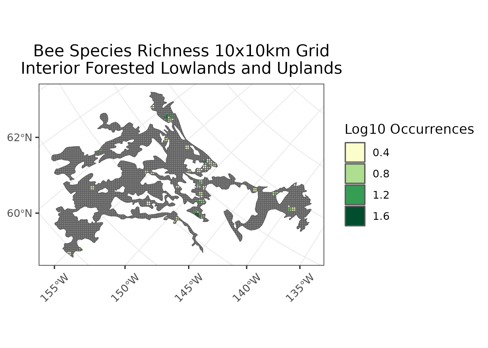

### Interior Forested Lowlands and Uplands 
Location: Covering a large portion of central Alaska, this is a diverse ecological region representing a patchwork of ecological characteristics.   
Climate: The ecoregion has a subarctic, continental-influenced climate, marked by cool to mild summers and long cold winters. Climate in this region is greatly influenced by distance from the ocean, elevation, and other factors. Summer temperatures can be relatively warm. The mean annual temperature ranges from approximately -7C to -3C. The mean annual precipitation ranges generally from 250 to 800 mm, and mostly occurs during summer convective storms.  
Vegetation: Needleleaf, broadleaf, and mixed forests occur, with a complex of vegetation communities resulting from the interplay of permafrost, surface water, fire, local elevational relief, and hillslope aspect.. White spruce forests and black spruce forests are common, along with some tamarack in the bottom areas. Broadleaf forest of balsam poplar and quaking aspen are on floodplains. A variety of willow scrub communities occur. There is a very high frequency of lightning fires.   
Hydrology: Streams within the region are mostly short. Larger streams originate in adjacent mountainous regions. Lakes are not abundant, although some thaw lakes and oxbow lakes occur.   
Terrain: Mostly rolling lowlands, dissected plateaus, and rounded low to high hills. Elevations range from sea level to over 700 m. Geology consists mostly of Mesozoic and Paleozoic sedimentary rocks, along with some areas of volcanic formations. Covered by undifferentiated alluvium and slope deposits, there is little exposure of bedrock. Permafrost is discontinuous, thicker and more continuous to the west. The region was not glaciated during the Pleistocene.   
Land Use: Subsistence and recreational hunting and fishing. Metals mining, coal and uranium mining, sand and gravel extraction.  
Note that the above fields were quoted directly from: Wiken et al. 2011 (see front page for full citation).  

