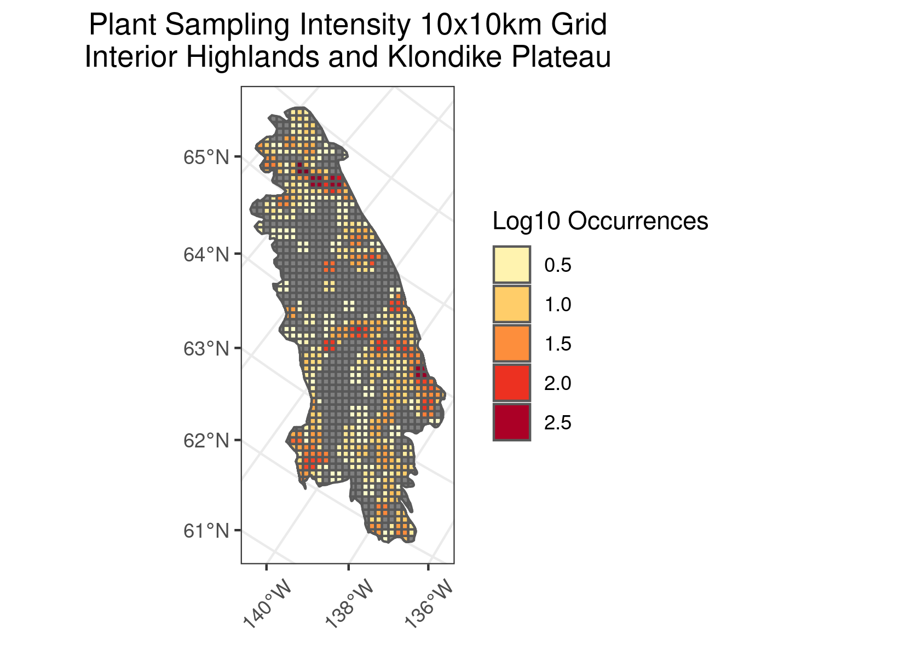
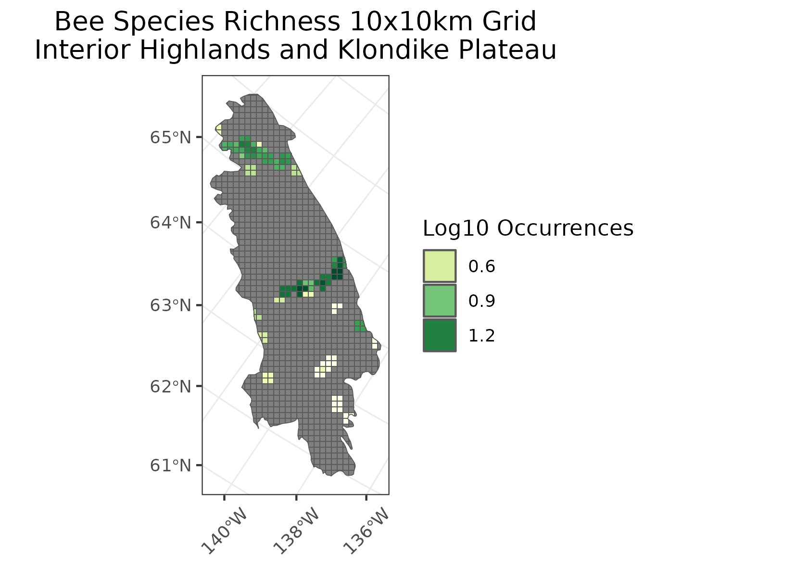
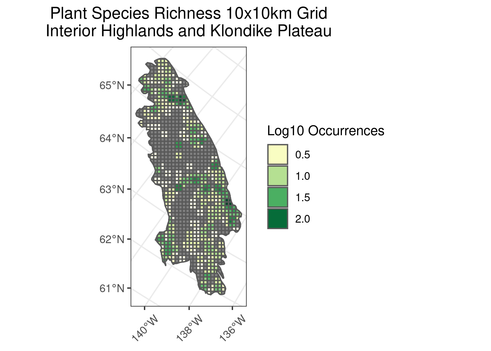
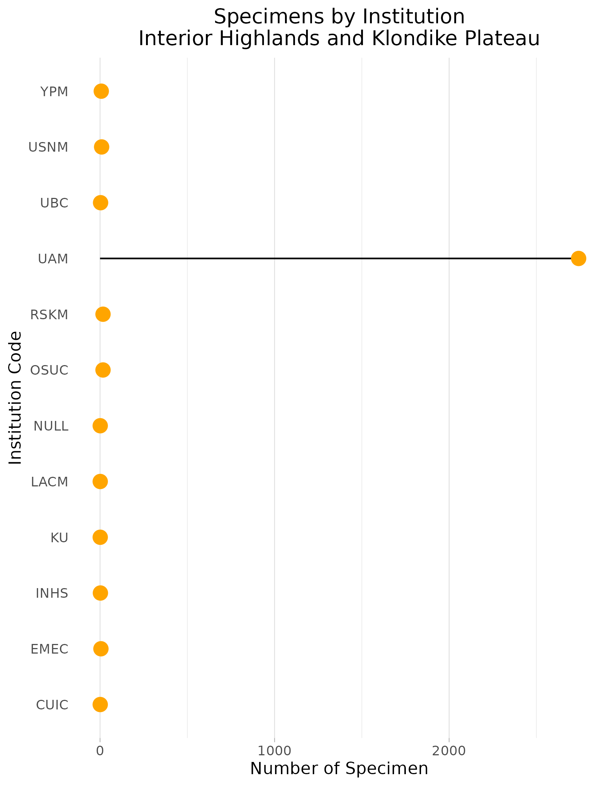
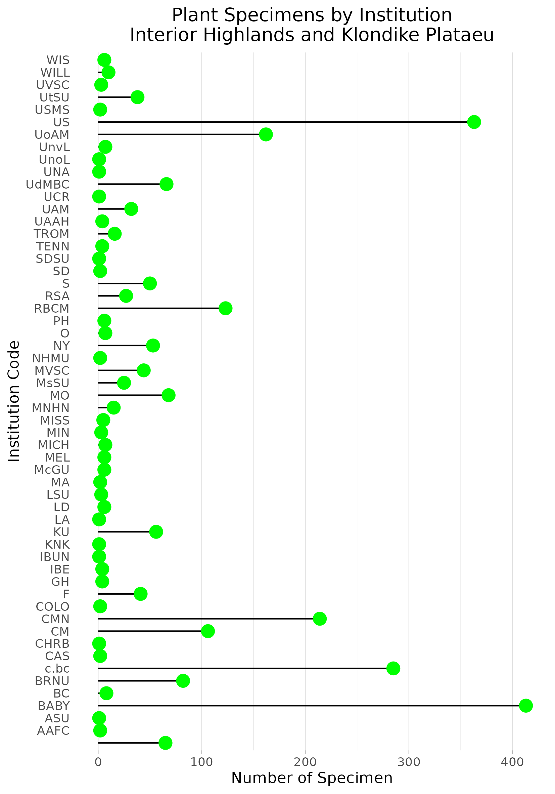
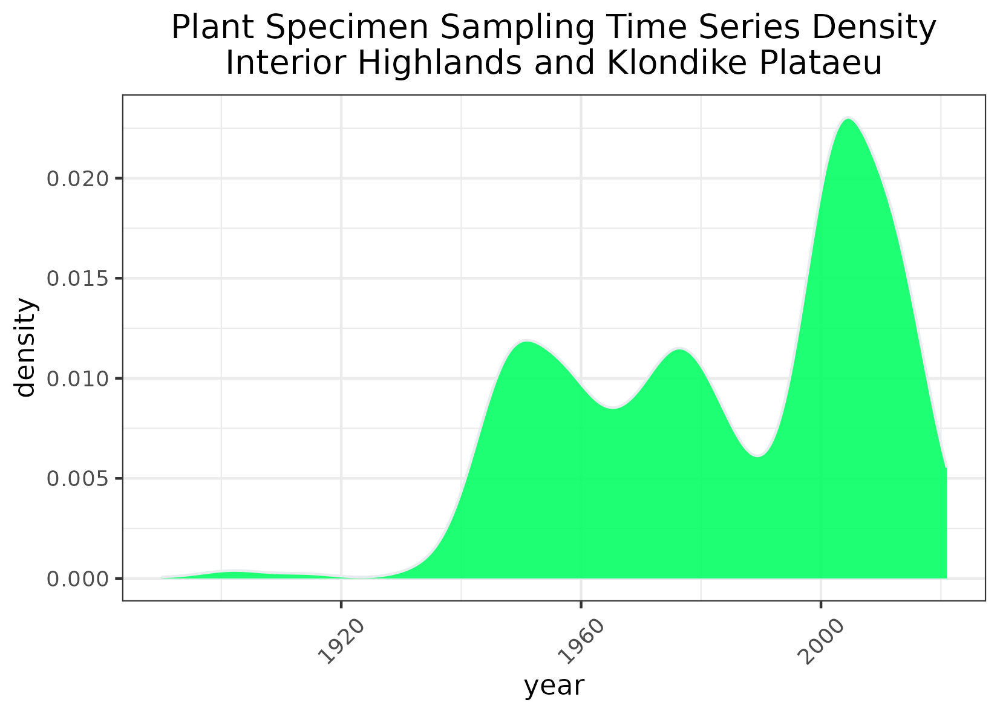
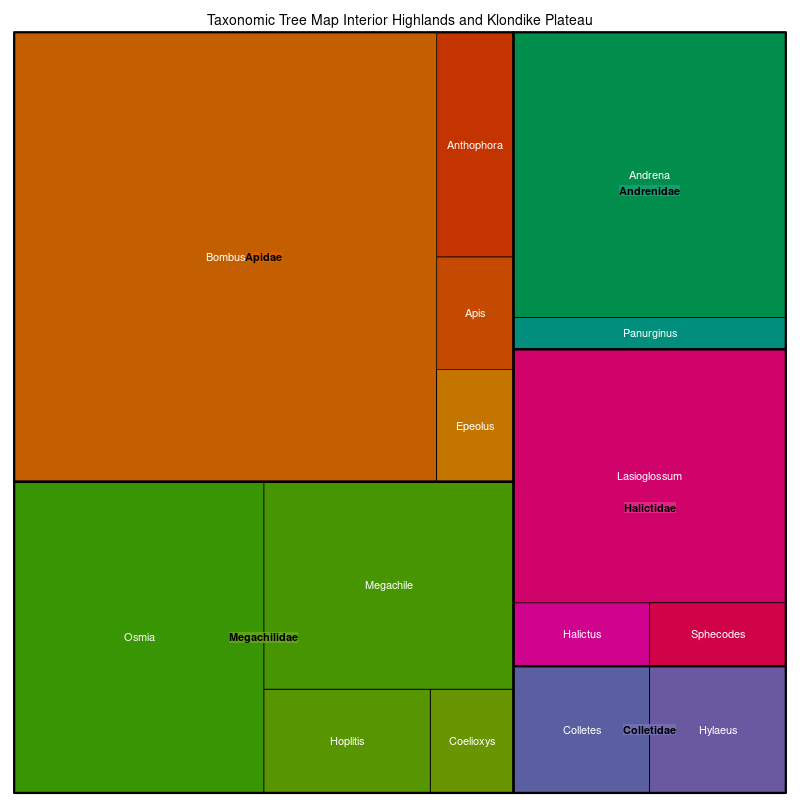
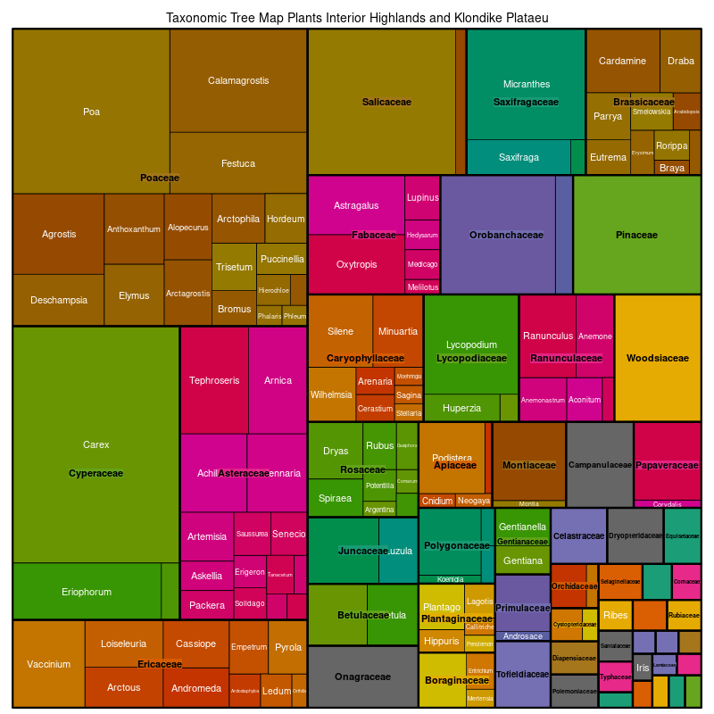

### Interior Highlands and Klondike Plateau
**Location:** A discontinuous ecoregion extending across the interior of central Alaska and extending into the Yukon Territory of Canada.   
**Climate:** The ecoregion has a continental subarctic climate, marked by short, warm summers and long, cold winters. Lower elevations can be quite warm in summer. The mean annual temperature is approximately -6C. The frost-free period ranges from 20 to 70 days. The region is generally more moist to the west, and mean annual precipitation ranges from about 300 to 900 mm on higher peaks.   
**Vegetation:** The highlands primarily sustain dwarf scrub vegetation and open spruce stands, although graminoid herbaceous communities occur in poorly drained areas. The highest elevations are mostly barren. Vegetation is dominated by white spruce, birch and aspen on south-facing slopes, black spruce on north-facing slopes, and black spruce woodlands and tussock and scrub bogs in valley bottoms. Above treeline, low birch-ericaceous shrubs and Dryas-lichen tundra dominate. This region has one of the highest incidences of lightning strikes in Alaska and the Yukon Territory, and wildfires are common.   
**Hydrology:** Some streams and rivers, although in the most rugged areas, surface water is minimal. Some lakes and wetlands in the broader valleys.  
**Terrain:** Steep rounded ridges, low mountains, often surmounted by rugged peaks, some rolling plateaus and incised valleys. Elevations range from 500 m in the valleys, while mountains in most parts of this region rise to at least 1200 m, and many rise higher than 1500 m. Most of the higher peaks were glaciated during the Pleistocene. Geology is mostly Paleozoic and Precambrian metamorphic rocks, felsic volcanic rocks, and intrusive rocks. Sedimentary rocks occur in some areas. Bedrock is often exposed. Permafrost is mostly discontinuous, except in the north where it is more continuous.   
**Land Use:** Subsistence and recreational hunting and fishing. Mineral mining. Some coal and uranium mining.  
Note that the above fields were quoted directly from: Wiken et al. 2011 (see front page for full citation).  

