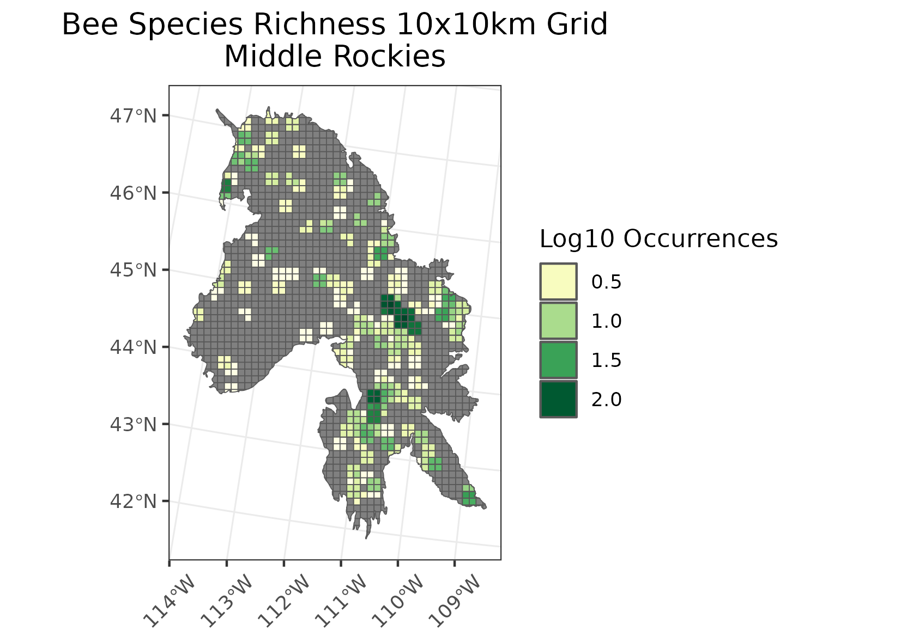
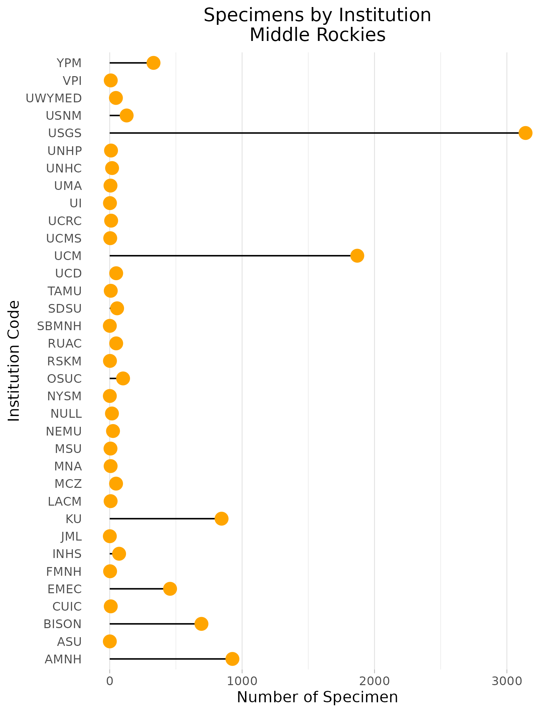
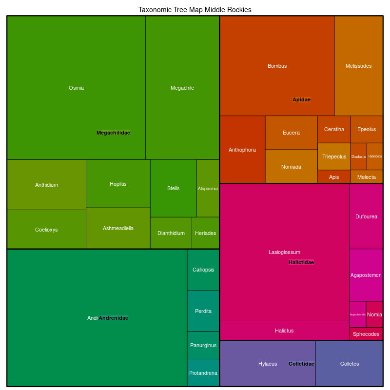

### Middle Rockies
Location: Mostly in southwestern Montana, eastern Idaho, and northern Wyoming. Also includes the Black Hills in western South Dakota and northeastern Wyoming.   
Climate: The ecoregion has a severe mid-latitude humid continental to climate. High elevations are more subarctic. The climate of the Middle Rockies lacks the strong maritime influence of the Northern Rockies (6.2.3). Generally it is marked by warm to cool summers and severe winters. The mean annual temperature varies greatly by elevation from approximately -5C to 8C. The frost-free period ranges from 25 to 140 days. The mean annual precipitation is 621 mm, ranging from 300 mm to over 2500 mm.  
Vegetation: Douglas-fir, lodgepole pine, aspen, subalpine fir, and Engelmann spruce forests. Forests can be open, and Pacific tree species are never dominant. Alpine grasslands, meadows, and krummholz. Ponderosa pine in the Black Hills. Foothills are partly wooded or shrub- and grass-covered. Intermontane valleys are grass- and/or shrub-covered. 
Hydrology: Numerous high gradient perennial streams and rivers. Small alpine glacial lakes and some larger lakes.  
Terrain: High alpine glaciated mountains, plateaus, glacial and lacustrine intermontane basins. A variety of rock types and ages, including Quaternary and Tertiary volcanics, Mesozoic and Paleozoic sedimentary materials, and Precambrian metamorphic and igneous rocks. Granitics and associated management problems are less extensive than in the Idaho Batholith (6.2.15). Mollisols, Inceptisols, and Alfisols are common, with mostly cryic or frigid soil temperature regimes and udic and ustic soil moisture regimes.  
Land Use: Recreation and tourism, forestry, mining, wildlife habitat, ranching and summer livestock grazing are common land uses. Some minor cropland in valleys, mostly hay, alfalfa, barley. Large areas are in public lands of national forests and national parks. Larger cities and towns include Missoula, Helena, Hamilton, Deer Lodge, Anaconda, Butte, Salmon, Dillon, Bozeman, Jackson, Deadwood, Custer, and Hot Springs.  
Note that the above fields were quoted directly from: Wiken et al. 2011 (see front page for full citation).  

