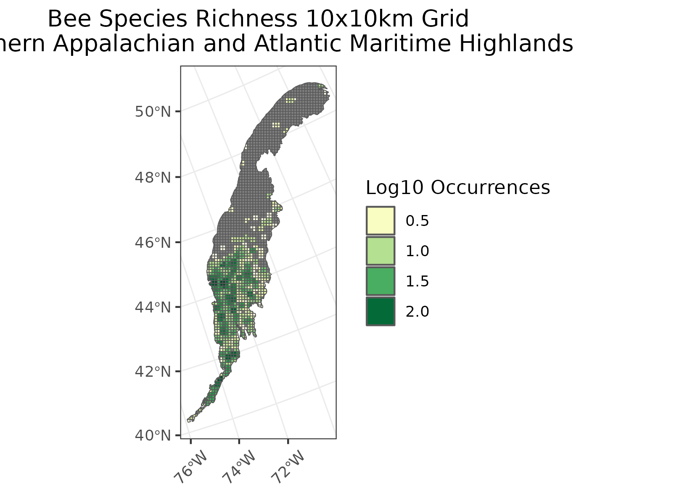
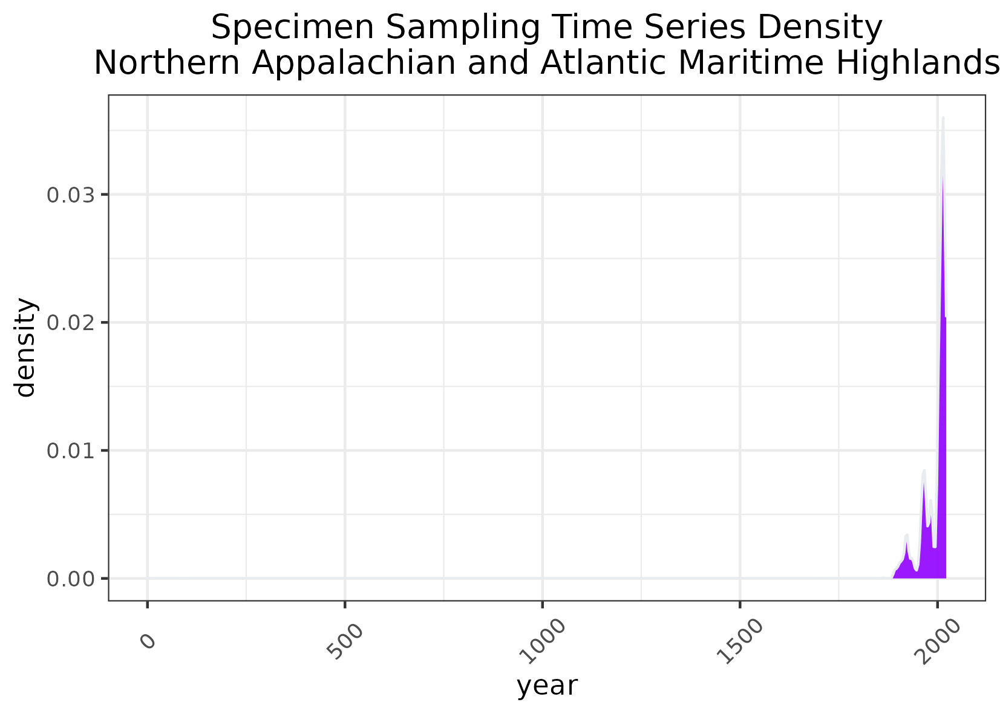
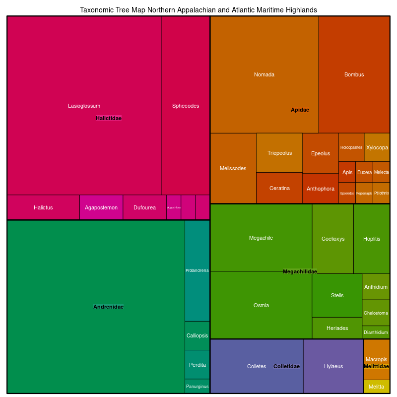

### Northern Appalachian and Atlantic Maritime Highlands 
**Location:** The ecoregion covers most of the northern and mountainous parts of New England, the Appalachians of Quebec, the uplands of Nova Scotia, as well as the Adirondacks and Catskill Mountains in New York.  
**Climate:** The ecoregion has a severe mid-latitude humid contintental climate, marked by warm summers and snowy, cold winters. The mean annual temperature ranges from approximately 1C to 8C. The frost-free period ranges from 100 to 180 days. The mean annual precipitation is around 1200 mm, ranging from 850 mm to over 2000 mm on high peaks.    
**Vegetation:** Mostly mixed hardwood and spruce-fir forests. Forest vegetation is somewhat transitional between the boreal regions to the north and the broadleaf deciduous forests to the south. Typical forests include mixed hardwoods of sugar maple, beech, and yellow birch; mixed forests with hardwoods and hemlock and white pine; and spruce-fir forests with balsam fir, red spruce, and birches. In swampy areas, black spruce, red maple, black ash, and tamarack.  
**Hydrology:** Numerous perennial high-gradient streams, and some larger rivers. Many large and small glacial lakes. Many of the lakes and streams in the region are sensitive to acidic deposition originating from industrial sources upwind from the ecoregion, particularly to the west.  
**Terrain:** Hills and mountains with narrow valleys. Some plains with hills. Nearly all of the region has been glaciated. A variety of metamorphic and igneous rocks occur, along with some areas of sedimentary materials. Soils are generally nutrient-poor, with frigid and some cryic soil temperature regimes and udic and some aquic soil moisture regimes. Spodosols and Inceptisols are typical.   
**Land Use:** This is a relatively sparsely populated region compared to adjacent regions, Recreation, tourism, and forestry are primary land uses. Farm-to-forest conversion began in the 19th century and continues today. In spite of this trend, alluvial valleys, glacial lake basins, and areas of limestone-derived soils are still farmed for dairy products, forage crops, apples, and potatoes. In addition to the timber industry, recreational homes and associated lodging and services sustain the forested regions economically, but they also create development pressure that threatens to change the pastoral character of the region. Major communities include Sherbrooke, Thetford, Mines, Rimouski, Matane, Murdochville, Gaspé, Bridgewater, Montpelier, Rutland, Keene, and Pittsfield.  
Note that the above fields were quoted directly from: Wiken et al. 2011 (see front page for full citation).  

