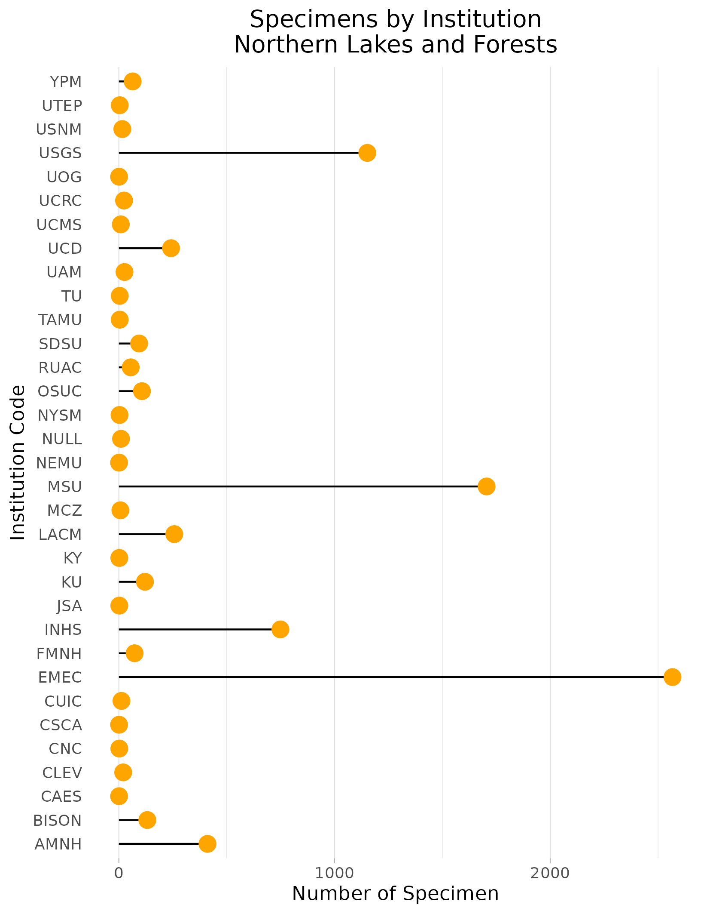

### Northern Lakes and Forests
Location: Southeast Manitoba, southwest Ontario, northeastern Minnesota, northern Wisconsin, and northern Michigan.   
Climate: The ecoregion has a severe mid-latitude humid continental climate, marked by warm summers and severe winters, with no pronounced dry season. The mean annual temperature ranges from approximately 2C to 6C; the mean summer temperature is 16C; and the mean winter temperature is -10C. The frost-free period ranges from 100 to 170 days. The mean annual precipitation is 768 mm, ranging from 500 mm to 960 mm.    
Vegetation: Mostly coniferous and northern hardwood forests, with sugar maple, red maple, yellow birch, aspen, white spruce, balsam fir, hemlock, eastern white pine, jack pine, red pine. Cooler and wetter sites with black spruce, tamarack, northern white cedar. 
Hydrology: Moderate to low gradient perennial streams. Wetland areas. The numerous glacial lakes that dot the landscape are clearer and less productive than those in ecoregions to the south. 
Terrain: Glaciated irregular plains and plains with hills. Undulating till plains, morainal hills, broad lacustrine basins, and extensive sandy outwash plains. Precambrian igneous and metamorphic rocks, ome Paleozoic sedimentary rocks. Mostly nutrient poor glacial soils occur. They are thicker than those in ecoregions to the north and generally lack the arability of soils in adjacent ecoregions to the south. Spodosols, Alfisols, and Histosols are typical, with frigid soil temperature regimes and aquic and udic soil moisture regimes.   
Land Use: Forestry, recreation, tourism, hunting and fishing, iron ore mining. Small areas with hay and grain crops, dairy cattle. Major cities and towns include Thunder Bay, Duluth, Superior, Ashland, Rhinelander, and Marquette. Some public national, state, and provincial park and forest lands.  
Note that the above fields were quoted directly from: Wiken et al. 2011 (see front page for full citation).  

