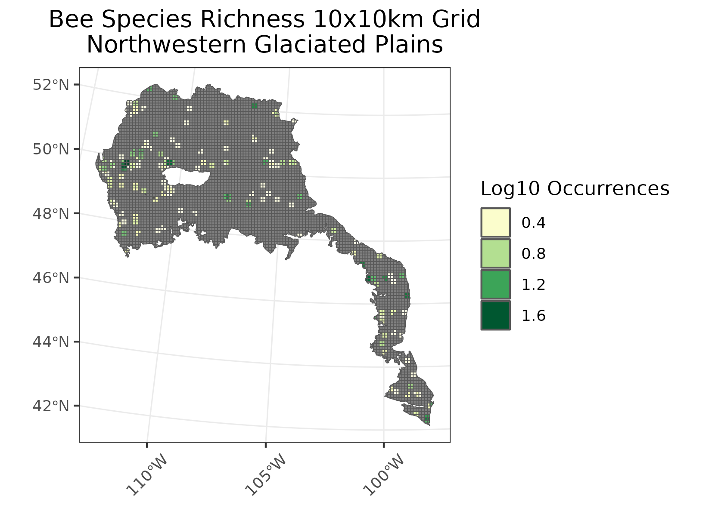

### Northwestern Glaciated Plains
Location: From Saskatoon in the north, the region covers portions of southwestern Saskatchewan, southeastern Alberta, northern Montana, along the Missouri River in the central Dakotas, and a small portion of northern Nebraska.   
Climate:   The ecoregion has mostly a dry, mid-latitude steppe climate. It is marked by warm to hot summers and cold winters. The mean annual temperatures range from 3C in the north to 7C in the south. The mean summer temperatures are approximately 16C and the mean winter temperatures are B10C. The frost-free period ranges from 95 days to 170 days. The mean annual precipitation ranges from 250-350 mm in drier areas and from 350-550 mm in moist areas. 
Vegetation: Spear grass, blue grama grass, and wheat grass were once dominant native grasses that cover many parts of the landscape. A variety of shrubs and herbs also were common as well as some sagebrush. On the driest sites yellow cactus and prickly pear can be found. Scrubby aspen, willow, cottonwood, and box-elder occur to a limited extent on shaded slopes of valleys and river terraces. Local saline areas support alkali grass, wild barley, greasewood, red sampire, and sea blite. 
Hydrology: Mostly intermittent and some perennial streams, some larger rivers. Drained by the Missouri River system to the south, and in the north by the South Saskatchewan River. In some areas, a high concentration of semi-permanent and seasonal wetlands, locally referred to as Prairie Potholes. 
Terrain: A transitional region between the generally more level, moister, more agricultural Northern Glaciated Plains (9.2.1) to the east and the generally more irregular, dryer, Northwestern Great Plains (9.3.3) to the south and southwest. The western and southwestern boundary in the U.S. portion roughly coincides with the limits of continental glaciation. The rolling hills and gentle plains are mantled almost entirely by glacial till, outwash, and glaciolacustrine sediments. Mollisols and some Entisols are common, with frigid soil temperature regimes, mesic in the south, and ustic soil moisture regimes.  
Land Use: angeland for cattle grazing, and some cropland. The production of spring wheat and other cereal grains occurs by employing a grainBfallow rotation. Oilseed crops are also important. Waterfowl hunting is common, and recreation is important around several large reservoirs. Larger communities include Lethbridge, Saskatoon, Moose Jaw, Regina, Medicine Hat, Swift Current, Great Falls, Havre, Bismarck, Mobridge, and O’Neill.  
Note that the above fields were quoted directly from: Wiken et al. 2011 (see front page for full citation).  

