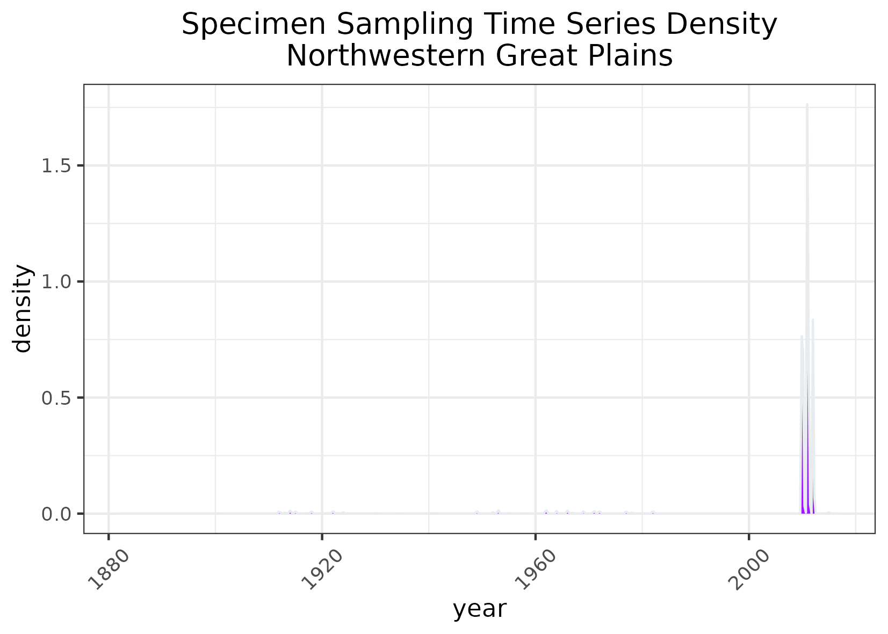

### Northwestern Great Plains 
Location: Encompasses the Missouri Plateau section of the Great Plains in southeast Montana, northeast Wyoming, and the western portion of the Dakotas.   
Climate: The ecoregion has a dry mid-latitude steppe climate. It is marked by hot summers and cold winters. The mean annual temperature is approximately 5C in some northern areas to 8.5C in the south. The frost-free period ranges from 90 days to 155 days. The mean annual precipitation is 393 mm, ranging from 250 mm to 510 mm.    
Vegetation: Grasslands persist in rangeland areas, especially on broken topography, but have been replaced by cropland on some areas of level ground. Shortgrass and mixedgrass prairies contain blue rama, western wheatgrass, green needlegrass, prairie sandreed, and buffalograss. Areas of sagebrush steppe with fringed sage, Wyoming big sagebrush, rabbitbrush, and sand sagebrush. Some areas with scattered ponderosa pine and Rocky Mountain juniper.  
Hydrology: Mostly ephemeral and intermittent streams, a few larger perennial rivers cross the region from the western mountains. Many small impoundments occcur, and some large reservoirs on the Missouri River.  
Terrain:  A rolling plain of shale and sandstone punctuated by occasional buttes. The region is unglaciated. Some areas of dissected, badland terrain and river breaks. Entisols, Mollisols, Aridisols, and Inceptisols occur. Frigid and mesic soil temperature regimes and ustic and aridic soil moisture regimes are typical.   
Land Use: Grassland and shrubland used for livestock grazing, mostly cattle and sheep. Agriculture is restricted by the erratic precipitation and limited opportunities for irrigation. Some areas grow wheat, alfalfa, and barley. A few areas of coal mining. Larger settlements include Billings, Lewiston, Livingston, Miles City, Dickinson, Mandan, Belle Fourche, Pierre, Rapid City, Sheridan, Gillette, and Casper.  
Note that the above fields were quoted directly from: Wiken et al. 2011 (see front page for full citation).  

