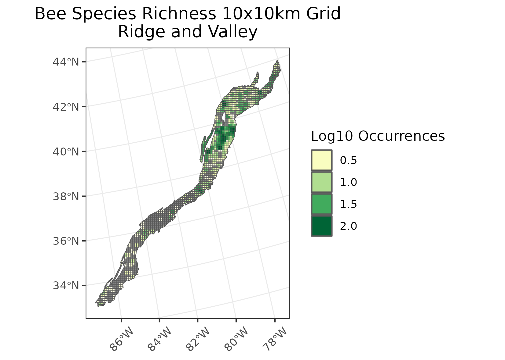
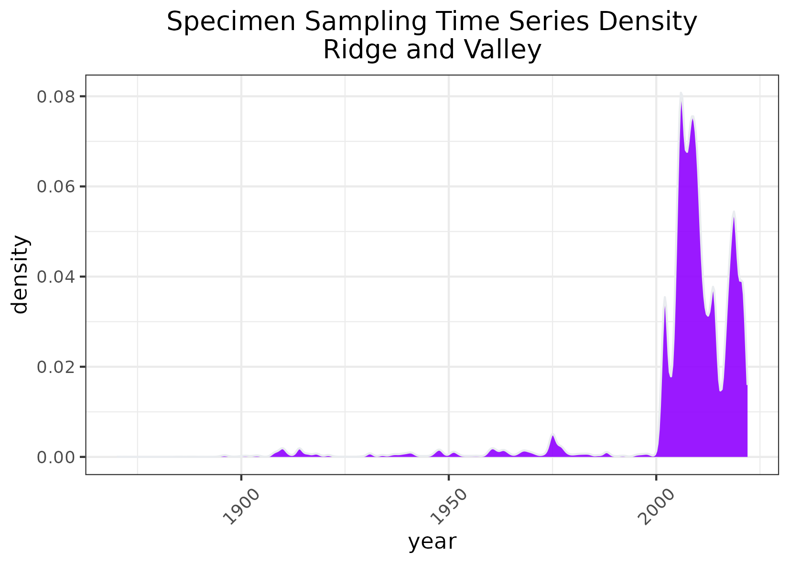

### Ridge and Valley 
Location: A diverse ecoregion of long latitudinal stretch, sandwiched between generally higher, more rugged mountainous ecoregions 8.4.2, 8.4.4, and 8.4.9. It occurs in New York, Pennsylvania, Maryland, West Virginia, Virginia, Tennessee, Georgia, and Alabama.  
Climate: The ecoregion has a humid continental climate, mild mid-latitude to the south, severe mid-latitude with cold winters to the north. Summers are hot and humid. The mean annual temperature varies from approximately 8C in the north to 16C in the south. The frost-free period ranges from 125 to 235 days. The mean annual precipitation is 1138 mm, and ranges from 900 mm to 1350 mm.   
Vegetation: Generally, Appalachian oak forest in the north, and oak-hickory-pine forest to the south.   
Hydrology: Much of the drainage is in a trellised pattern, with small streams draining the ridge slopes, joining at right angles with larger, lower-gradient stream courses that meander along the parallel valley floors. The ecoregion has a diversity of aquatic habitats and species of fish. Springs and caves are relatively numerous. Some large reservoirs in the south.  
Terrain:  A northeast-southwest trending region, relatively low-lying, with ridges, rolling valleys, and low irregular hills. As a result of extreme folding and faulting events, the region’s roughly parallel ridges and valleys have a variety of widths, heights, and geologic materials, including limestone, dolomite, shale, siltstone, sandstone, chert, mudstone, and marble. Some ridges rise to 1500 m in elevtion. Ultisols and Inceptisols are typical, with mesic to thermic soil temperature regimes and udic soil moisture regimes.  
Land Use: A mosaic of woodland, pasture, and cropland. Present-day forests cover about 50% of the region. Some areas of pine plantations. Hay, pasture, and grain for beef and dairy cattle are common crops, along with some areas of corn, soybeans, tobacco, and cotton in the south. Areas of rural residential, urban, and industrial. Larger cities include Scranton, Wilkes Barre, Reading, Harrisburg, and State College, Pennsylvania; Hagerstown and Cumberland, Maryland; Martinsburg, West Virginia; Winchester, Harrisonburg, Staunton, Roanoke, and Blacksburg, Virginia; Johnson City, Knoxville, Oak Ridge, and Chattanooga, Tennessee; Dalton and Rome, Georgia; and Gadsden, Anniston, and Birmingham, Alabama.  
Note that the above fields were quoted directly from: Wiken et al. 2011 (see front page for full citation).  

