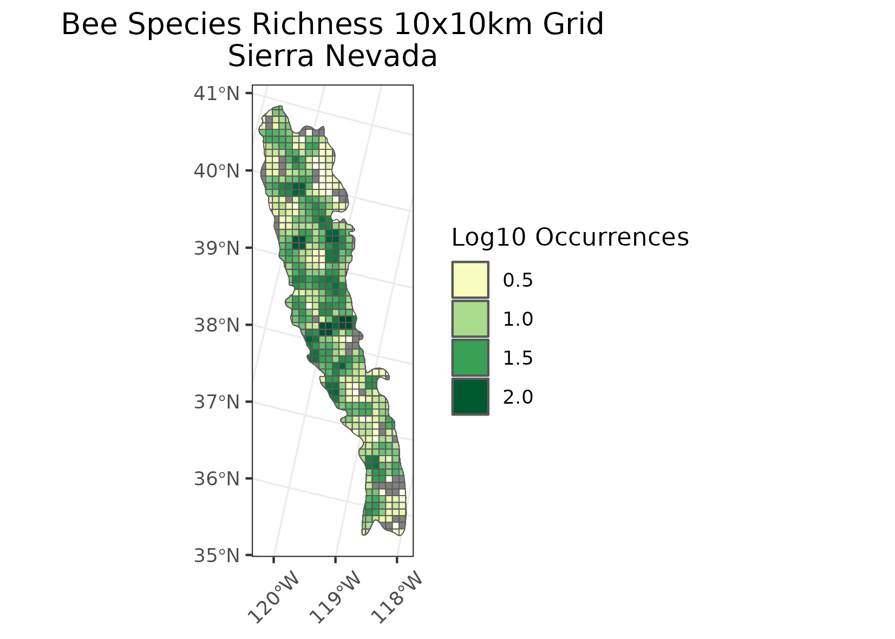
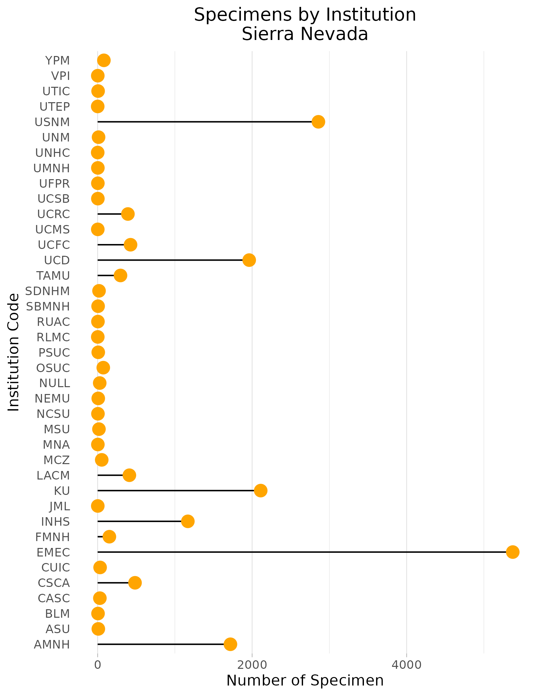
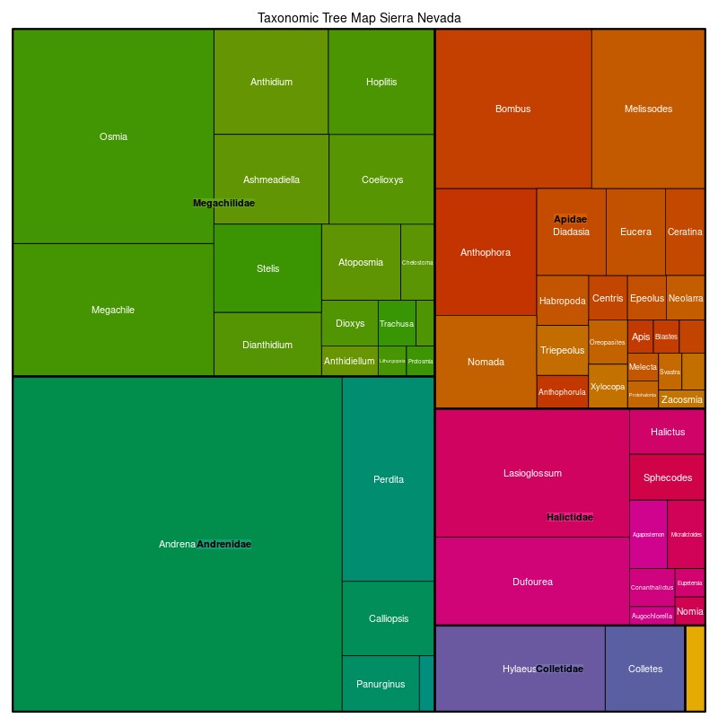

### Sierra Nevada (The Best Ecoregion, No Bias present) 
Location: A high north-south mountain range of eastern California with a small extension into far western Nevada near Lake Tahoe.   
Climate: The ecoregion has a severe to mild mid-latitude climate with Mediterranean characteristics. It has mild to hot dry summers and cool to cold wet winters. The mean annual temperature ranges from  approximately -3C at high elevations to 17C at low elevations on the southwest. The frost-free period ranges from 30 to 320 days. The mean annual precipitation is 1070 mm, ranging from 150 mm in the eastern lowlands to over 2500 mm on high elevation peaks.   
Vegetation: Very diverse temperate coniferous forests. The vegetation grades from chaparral and oak woodland to mostly ponderosa pine at the lower elevations on the west side, and lodgepole pine on the east side, to mixed conifer forests of ponderosa pine, sugar pine, Douglas-fir, and white fir. Giant sequoias occur in some areas, the most massive trees on Earth. At higher elevations, white fir and red fir forests, and in the subalpine zone, lodgepole pine, Jeffrey pine, western white pine, limber pine, and aspen. Alpine conditions exist at the highest elevations.  
Hydrology: Many high-gradient perennial streams and rivers. Numerous alpine lakes and several reservoirs. Rainfall and snowpack provide water for adjacent low elevation ecoregions.  
Terrain: : The Sierra Nevada is a deeply dissected block fault that rises sharply from the arid, basin and range ecoregions on the east and slopes gently toward the Central California Valley (11.1.2) to the west. It has hilly to steep mountain relief. The eastern portion has been strongly glaciated and generally contains higher mountains than are found in the Klamath Mountains (6.2.11) to the northwest. Elevations range from about 400 m to 4418 m on Mt. Whitney, the highest point in the lower 48 United States. Much of the central and southern parts of the region is underlain by granite as compared to the mostly sedimentary formations of the Klamath Mountains and volcanic rocks of the Cascades (6.2.7). There are some areas of metamorphic and volcanic rocks, mostly in the north. Alfisols, Entisols, Inceptisols, Mollisols, and Ultisols occur. There are mesic, frigid, and cryic soil temperature regimes, and mostly xeric and udic soil moisture regimes. 
Land Use:  Recreation and tourism, forestry, rural residential, some ranching and woodland grazing, some mining. The higher elevations of this region are mostly public lands with national forests, national monuments, and several national parks (Lassen, Yosemite, Kings Canyon, and Sequoia). Larger settlements include Susanville, Quincy, Nevada City, Grass Valley*, Truckee, South Lake Tahoe, and Mammoth Lakes.  
Note that the above fields were quoted directly from: Wiken et al. 2011 (see front page for full citation).  

