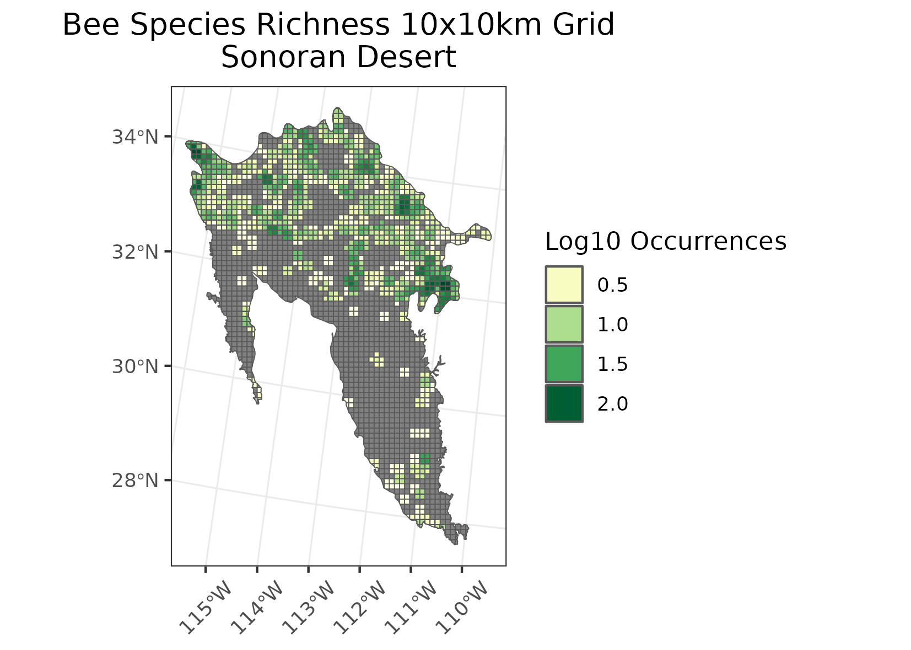

### The Sonoran
**Location:** Southeastern California through Southwestern Arizona. 
**Climate:** Dry subtropical desert climate, very hot summers and mild winters. Winter rainfall decreases moving from West to East, while summer rainfall decrases moving East to West.    
**Vegetation:** Cactus, Larrea (creosotebush), ironwood, mesquite, etc.  
**Hydrology:** Mostly emphemeral streams. Few water sources outside of the Colorado river. Many internally drained basins that terminate within the playas. 
**Terrain:** Fault-block mountain ranges. Elevation ranges from 0 ft to 1400 ft. Soil regimes vary from hyperthermic to aridic.  
**Land Use:** Small cropland areas (intesively irrigated), livestock grazing, military training grounds, national parks, and national wildlife refuges. Large cities/towns include: Blythe, Pheonix, Tuscon, Mexicali, Yuma, etc.  

