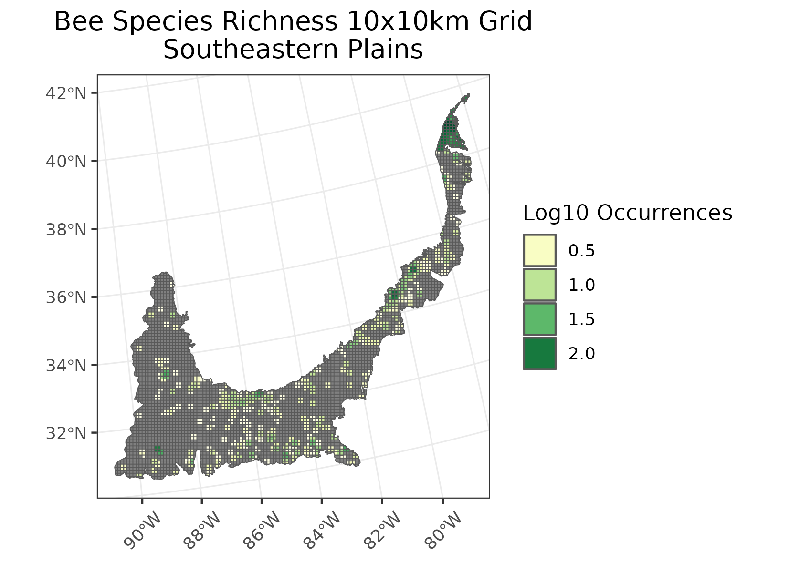
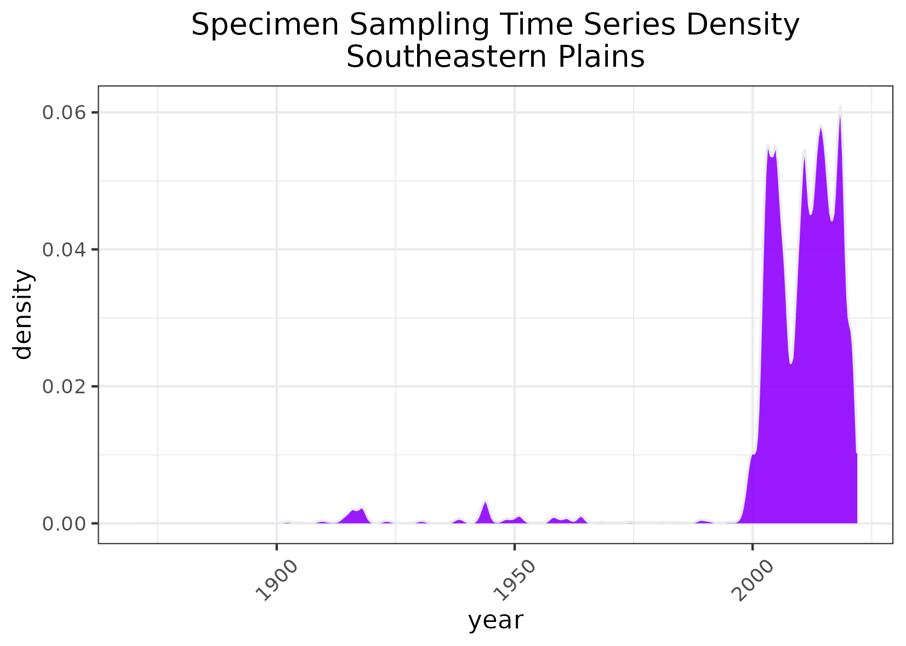

### Southeastern Plains 
**Location:** An inner coastal plain that stretches from Maryland in the north to Mississippi and Louisiana in the south.   
**Climate:** The ecoregion has a mild, mid-latitude humid subtropical climate.It has hot, humid summers and mild winters. Mean annual temperatures range from 13C in the north to 19C in the south. The frost-free period ranges from 200 days in the north to 300 days in the south. The mean annual precipitation is 1358, and ranges from 1140 mm to 1520 mm. Precipitation is fairly evenly distributed throughout the year.   
**Vegetation:** Natural vegetation was predominantly longleaf pine with smaller areas of oak-hickory-pine, and in the south some Southern mixed forest with beech, sweetgum, southern magnolia, laurel and live oaks, and various pines. Floodplains include bottomland oaks, red maple, green ash, sweetgum, and American elm, and areas of bald cypress, pond cypress, and water tupelo.  
**Hydrology:** Moderate to dense network of perennial streams and rivers, generally moderate to low gradient, often with sandy substrates. Few natural lakes but several large reservoirs.  
**Terrain:** Dissected, rolling to smooth plains. The Cretaceous or Tertiary-age sands, silts, and clays of this region contrast geologically with the older metamorphic and igneous rocks of the Piedmont (8.3.4), and with the Paleozoic limestone, chert, and shale of the Interior Plateau (8.3.3). Elevations and relief are greater than in the Southern Coastal Plain (8.5.3) and Mississippi Alluvial Plain (8.5.2).   
**Land Use:** Mosaic of cropland, pasture, woodland, and forest land cover. Large areas of pine plantations and successional pine and hardwood woodlands. Agriculture includes corn, cotton, soybeans, peanuts, onions, sweet potatoes, melons, tobacco, poultry, and hogs. Cities include Richmond, Fayetteville, Columbia, Augusta, Columbus, Tallahassee, Montgomery, and Hattiesburg.  
Note that the above fields were quoted directly from: Wiken et al. 2011 (see front page for full citation).  

