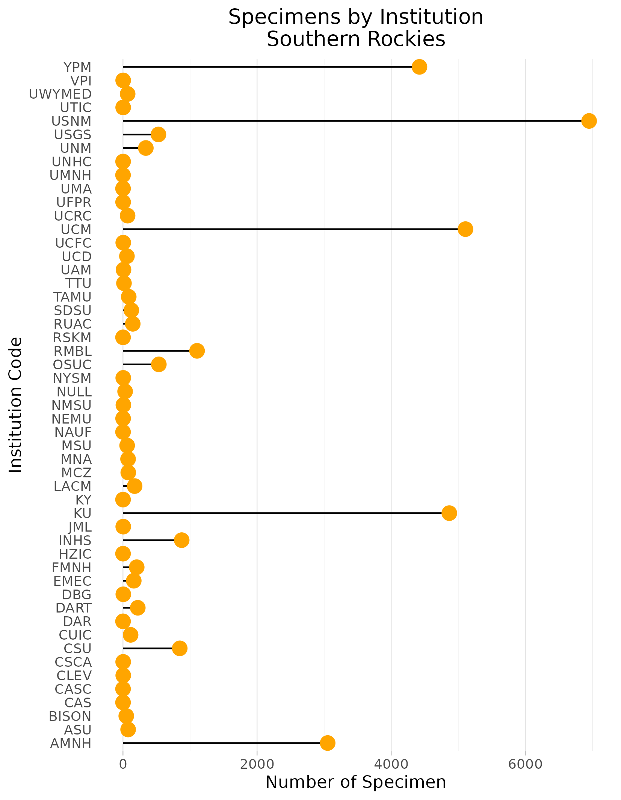
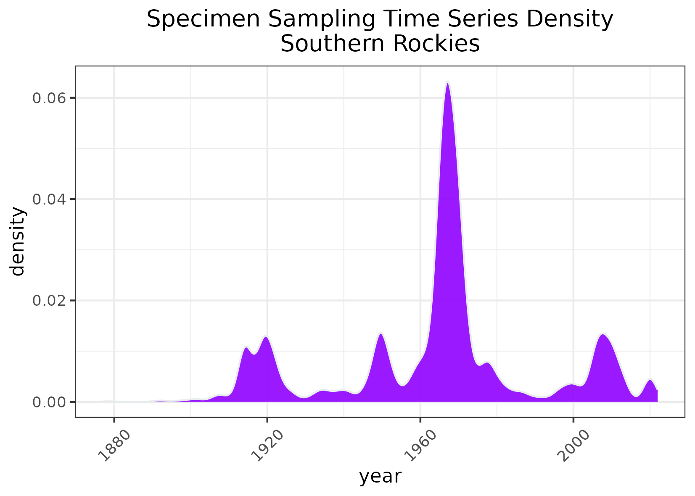

### Southern Rockies
Location: The portion of the Rocky Mountains extending from southern Wyoming, through Colorado, and into northern New Mexico. Two small outliers occur in eastern Utah.  
Climate: The ecoregion has a severe mid-latitude humid continental climate, with a subarctic climate at high elevations. The region has warm to cool summers and severe winters, with no pronounced dry season. The mean annual temperature is approximately -4C at highest elevations to 11C in warmer lowlands. The frost-free period ranges from 25 to 150 days. The mean annual precipitation is 588 mm, ranging from 255 mm in low dry areas to over 1750 on the wetter high peaks. Deep snowpacks occur at high elevations.  
Vegetation: Coniferous forests cover much of the region, with a pattern of elevational banding. The lowest elevations are generally grass or shrub covered, with sagebrush, mountain mahogany, pinyon, juniper, or scattered Gambel oak woodlands. Low to middle elevations are covered by a variety of vegetation types including juniper oak woodlands, ponderosa pine, Douglas-fir, and aspen. Middle to high elevation forests of Englemann spruce, subalpine fir, aspen. The highest elevations have alpine low shrubs, cushion plants, sedges, and krummholz vegetation of stunted spruce, fir, and pine.  
Hydrology: Many medium and high-gradient perennial streams and rivers. Numerous alpine lakes and several reservoirs. Rainfall and snowpack provide water for adjacent low elevation ecoregions.  
Terrain: High elevation, steep rugged mountains, with both linear ranges and complex masses of peaks. Middle to high elevations have been glaciated. Some high intermontane valleys. Elevations range from 1550 m to over 4390 m. More than fifty peaks are over 4270 m. Complex geologic mix with Precambrian metasedimentary, metavolcanic, and intrusive rocks, Tertiary and Cretaceous sedimentary rocks, and Tertiary volcanic rocks. Alfisols, Entisols, and Mollisols are the primary soil orders, with mostly frigid and cryic soil temperature regimes and udic and ustic soil moisture regimes.    
Land Use: Forestry, gold, copper, and silver mining, tourism and recreation, ranching and livestock grazing, rural residential. Large areas are in public land as national forests, national parks, or national monuments. Larger towns include Steamboat Springs, Estes Park, Kremmling, Glenwood Springs, Breckenridge, Leadville, Aspen, Gunnison, Telluride, Pagosa Springs, Tierra Amarilla, Los Alamos, and Mora. 
Note that the above fields were quoted directly from: Wiken et al. 2011 (see front page for full citation).  

